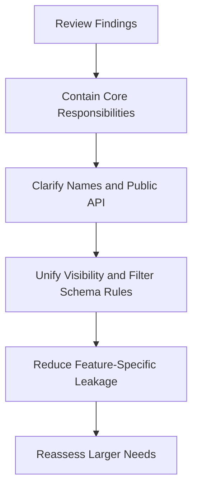

# AppDataGrid Health Plan

## Goal
Stabilize [`src/ui/patterns/AppDataGrid`](src/ui/patterns/AppDataGrid) before more toolbar and filter features land, without rewriting the module. The main objective is to reduce pressure on the core component, clarify ownership boundaries, and prevent schema duplication from spreading further into feature code.

## Current Assessment
The module is still usable and worth preserving, but it is beginning to centralize too many concerns.

The most important pressure points are:
- [`src/ui/patterns/AppDataGrid/core/AppDataGrid.tsx`](src/ui/patterns/AppDataGrid/core/AppDataGrid.tsx) is becoming a coordination hub for toolbar rendering, search/filter state, badge derivation, column adaptation, and special-case product behavior.
- [`src/ui/patterns/AppDataGrid/filters/toolbarFilters.ts`](src/ui/patterns/AppDataGrid/filters/toolbarFilters.ts) now owns more than its name suggests: defaults, range normalization, and badge formatting.
- [`src/ui/patterns/AppDataGrid/types/appDataGrid.types.ts`](src/ui/patterns/AppDataGrid/types/appDataGrid.types.ts) and [`src/ui/patterns/AppDataGrid/types/appDataGridFilter.types.ts`](src/ui/patterns/AppDataGrid/types/appDataGridFilter.types.ts) are mostly healthy, but naming and public API shape are starting to blur responsibilities.
- [`src/ui/patterns/AppDataGrid/viewer/columnsForViewer.ts`](src/ui/patterns/AppDataGrid/viewer/columnsForViewer.ts) and [`src/ui/patterns/AppDataGrid/viewer/filtersForViewer.ts`](src/ui/patterns/AppDataGrid/viewer/filtersForViewer.ts) duplicate the same viewer-policy pattern.
- [`src/features/content/shared/components/contentListTemplate.tsx`](src/features/content/shared/components/contentListTemplate.tsx), [`src/features/content/shared/components/ContentTypeListPage.tsx`](src/features/content/shared/components/ContentTypeListPage.tsx), and routes like [`src/features/content/spells/routes/SpellListRoute.tsx`](src/features/content/spells/routes/SpellListRoute.tsx) show that content-list composition is standardized, but also reveal repeated viewer filtering, toolbar layout wiring, and preference plumbing.

## Refactor Strategy
Use a containment-first sequence. Start by making the existing module easier to reason about and safer to extend, then address public API drift, then decide whether any feature-specific behavior should move out of the shared pattern.

## Stage 1: Worth Doing Now
Focus on low-risk cleanup that improves clarity without changing the module's external behavior.

- Shrink the responsibility surface of [`src/ui/patterns/AppDataGrid/core/AppDataGrid.tsx`](src/ui/patterns/AppDataGrid/core/AppDataGrid.tsx) by defining internal seams for:
  - toolbar state and reset behavior
  - filter application and search matching
  - active badge derivation
  - column-to-MUI mapping
- Clean up naming drift in the shared module:
  - rename `toolbarFilters` to something responsibility-based like `filterState` or split it into smaller concern-based helpers
  - align `chip` terminology with `badge` terminology in filter metadata and helper names
  - remove the duplicate alias pattern around `mapFiltersById` / `indexAppDataGridFiltersById`
- Narrow the public surface in [`src/ui/patterns/AppDataGrid/index.ts`](src/ui/patterns/AppDataGrid/index.ts) and [`src/ui/patterns/AppDataGrid/filters/index.ts`](src/ui/patterns/AppDataGrid/filters/index.ts) so internal-only helpers are not exported unless real consumers need them.

## Stage 2: Worth Planning Soon
Address the design choices that will become more expensive as richer toolbar behavior is added.

- Introduce a clearer separation between generic grid infrastructure and toolbar-specific orchestration inside [`src/ui/patterns/AppDataGrid`](src/ui/patterns/AppDataGrid).
- Unify viewer visibility concepts used by columns and filters so they do not continue as parallel implementations in:
  - [`src/ui/patterns/AppDataGrid/viewer/columnsForViewer.ts`](src/ui/patterns/AppDataGrid/viewer/columnsForViewer.ts)
  - [`src/ui/patterns/AppDataGrid/viewer/filtersForViewer.ts`](src/ui/patterns/AppDataGrid/viewer/filtersForViewer.ts)
  - [`src/ui/patterns/AppDataGrid/types/appDataGridFilter.types.ts`](src/ui/patterns/AppDataGrid/types/appDataGridFilter.types.ts)
  - [`src/ui/patterns/AppDataGrid/types/appDataGrid.types.ts`](src/ui/patterns/AppDataGrid/types/appDataGrid.types.ts)
- Revisit whether campaign-content-specific toolbar utilities should remain embedded in shared grid behavior, especially the `allowedInCampaign` and `hideDisallowed` path currently coordinated through:
  - [`src/ui/patterns/AppDataGrid/types/appDataGridToolbar.types.ts`](src/ui/patterns/AppDataGrid/types/appDataGridToolbar.types.ts)
  - [`src/features/content/shared/hooks/useContentListPreferences.ts`](src/features/content/shared/hooks/useContentListPreferences.ts)
  - [`src/features/content/shared/components/contentListTemplate.tsx`](src/features/content/shared/components/contentListTemplate.tsx)
- Reduce repetitive composition work in content list routes by deciding whether viewer filtering, layout resolution, and persisted filter wiring belong in route code or in the shared content-list layer.

## Stage 3: Defer For Now
These are real concerns, but they should wait until the containment work above is complete.

- A full rewrite of `AppDataGrid`
- A generalized plugin system for all toolbar utilities
- A server-driven filtering/search model unless current list sizes or upcoming requirements make it necessary
- Breaking every filter variant or column behavior into tiny files before the larger ownership boundaries are clarified

## Specific Review Targets
Use these as the primary checkpoints when evaluating the refactor:

- [`src/ui/patterns/AppDataGrid/core/AppDataGrid.tsx`](src/ui/patterns/AppDataGrid/core/AppDataGrid.tsx): reduce god-file risk
- [`src/ui/patterns/AppDataGrid/types/appDataGrid.types.ts`](src/ui/patterns/AppDataGrid/types/appDataGrid.types.ts): keep the public grid contract understandable
- [`src/ui/patterns/AppDataGrid/types/appDataGridFilter.types.ts`](src/ui/patterns/AppDataGrid/types/appDataGridFilter.types.ts): preserve the healthy filter union while fixing naming drift
- [`src/ui/patterns/AppDataGrid/filters/toolbarFilters.ts`](src/ui/patterns/AppDataGrid/filters/toolbarFilters.ts): split mixed responsibilities if it continues growing
- [`src/features/content/shared/components/contentListTemplate.tsx`](src/features/content/shared/components/contentListTemplate.tsx): watch for schema duplication between shared content-list builders and grid config
- [`src/features/content/shared/components/ContentTypeListPage.tsx`](src/features/content/shared/components/ContentTypeListPage.tsx): confirm whether this should absorb more repetitive route composition

## Success Criteria
This effort should be considered successful if:
- `AppDataGrid` is easier to scan and extend without reading one large file end to end
- the module’s names describe responsibility instead of historical implementation details
- toolbar-specific logic has clearer boundaries
- viewer visibility rules have one clearer source of truth
- content-list features can keep composing the grid without increasing duplication around layout, gating, or persisted filter behavior

## Recommended Next Step
Start with a small design pass on [`src/ui/patterns/AppDataGrid/core/AppDataGrid.tsx`](src/ui/patterns/AppDataGrid/core/AppDataGrid.tsx) and [`src/ui/patterns/AppDataGrid/filters/toolbarFilters.ts`](src/ui/patterns/AppDataGrid/filters/toolbarFilters.ts) to define the internal seams and naming cleanup that can happen without changing behavior. That gives the team a practical first refactor slice and creates a cleaner base before touching viewer rules or content-specific utilities.