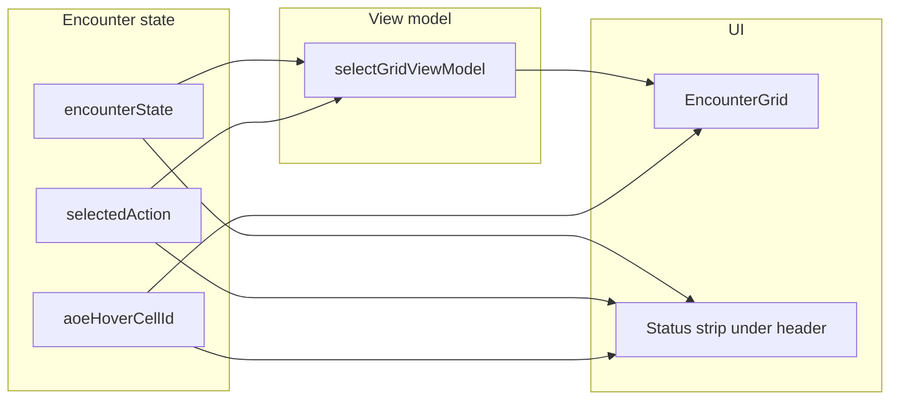

# EncounterGrid first-pass UX plan

## Current architecture (what we will reuse)

- `**[selectGridViewModel](src/features/encounter/space/space.selectors.ts)**` builds per-cell flags including `isActive`, `isSelectedTarget`, `isWithinSelectedActionRange` (renamed from `isInRange`: distance from actor to cell within selected action `rangeFt`), `isReachable` (movement), and AoE flags. The broad “light tint” was removed from this flag at the UI layer (no full-cell fill from distance ring).
- **Hover cell id** is already updated on every pointer enter: `[EncounterActiveRoute](src/features/encounter/routes/EncounterActiveRoute.tsx)` `handleCellHover` → `setAoeHoverCellId` (name is legacy; value is global hovered cell for the grid). No new hover pipeline is required—only **pass this id back into `EncounterGrid`** as an explicit `hoveredCellId` prop for hover styling.
- **Grid view model options** are assembled in `[EncounterRuntimeContext](src/features/encounter/routes/EncounterRuntimeContext.tsx)` (`gridViewModel` useMemo). Today it passes `selectedActionRangeFt` but not the full `selectedAction`; we will add `selectedAction` to opts so the selector can compute **token-level legality** using existing mechanics: `[isValidActionTarget](src/features/mechanics/domain/encounter/resolution/action/action-targeting.ts)` / `[getActionTargetInvalidReason](src/features/mechanics/domain/encounter/resolution/action/action-targeting.ts)` (already authoritative for “why illegal”).

## 1) Grid view model: selective targeting + soften active cell

**File:** `[src/features/encounter/space/space.selectors.ts](src/features/encounter/space/space.selectors.ts)`

- Extend `selectGridViewModel` options with `selectedAction: CombatActionDefinition | null` (import type only from mechanics).
- Add fields on `GridCellViewModel` (names can vary, intent is fixed):
  - `**isLegalTargetForSelectedAction`**: `occupantId` present, a creature-targeting action is selected, and `isValidActionTarget(state, combatant, actor, selectedAction)` is true. Otherwise false or omitted when N/A (no occupant or action does not call for that kind of selection).
  - Optionally keep `**isWithinActionRange`** as the pure distance check (today’s `inRange` logic) for internal styling if needed; **stop using it for full-cell background** in the grid.
- **Deprecate broad cell fill driven by `isInRange`** at the UI layer (field can remain for a transition or be renamed in the same PR if you prefer clarity).
- Add `**isHostileTargetEmphasis**` (or derive in UI): `isSelectedTarget && occupantId && selectedAction && isHostileAction(selectedAction) && isLegal…` for the subtle red pulse constraint (only selected valid hostile target).

**File:** `[EncounterRuntimeContext.tsx](src/features/encounter/routes/EncounterRuntimeContext.tsx)`

- Pass `selectedAction` into `selectGridViewModel` alongside existing args.

## 2) EncounterGrid: visuals, cursor, empty-cell hover

**File:** `[src/features/encounter/components/active/grid/EncounterGrid.tsx](src/features/encounter/components/active/grid/EncounterGrid.tsx)`

**Props (minimal additions):**

- `hoveredCellId: string | null` — from route/context (`aoeHoverCellId`).
- `hasMovementRemaining: boolean` — `(activeCombatant?.turnResources?.movementRemaining ?? 0) > 0` (or pass a number if you prefer one prop).
- Optional: `gridInteractionCursorMode` avoided; derive cursor from existing per-cell flags + `hoveredCellId` + new view-model fields.

`**cellColor` / stacking priorities**

- **Remove** the unconditional full-cell branch for the old range ring (`isInRange`).
- **Soften** `isActive` cell background (secondary tint) so the **token** carries the strongest “current turn” signal.
- **Soften** `isReachable` movement treatment: lower alpha, or combine **faint fill + light border** instead of strong solid green—goal is less board noise while keeping reach obvious.
- **AoE / walls / blocking** keep existing precedence where it still makes sense; ensure active-turn token styling remains visible when movement or AoE overlays overlap (z-index / token glow wins over mild cell tint).

**Current-turn token (strongest persistent signal)**

- On the token wrapper for `cell.isActive`, add a **restrained CSS pulse/glow** (`@keyframes` + `boxShadow` or a thin outer ring). Keep outline/boxShadow stack coherent with targeting rings.

**Ally vs opponent (token-first)**

- Strengthen **ring/frame** via `tokenColor` / border width / subtle dual-ring for party vs enemies; avoid introducing new full-cell team fills.

**Selective targeting feedback**

- **Legal targets:** modest positive ring/tint on the **token** (not the whole cell), distinct palette for hostile vs non-hostile application (`isHostileAction` from mechanics).
- **Hovered legal target:** slightly stronger than baseline legal.
- **Selected target:** strongest; **subtle red pulse only** when `isHostileTargetEmphasis` (per your rule).
- **Illegal occupied targets** under a relevant selected action: no “positive” treatment; optional faint error accent only on hover via `hoveredCellId` match.

**Cursor rules**

- Default/grid pan: keep `grab`/`grabbing` behavior as today.
- `**not-allowed`** when:
  - `hasMovementRemaining` and hovered cell is **empty**, passable, **not** `isReachable`, and not the active cell (mirror `canMoveTo` semantics already encoded in reachable set + occupancy).
  - Action targeting context: hovered **occupant** is illegal for `selectedAction` (use `isLegalTargetForSelectedAction === false` with a guard that the action actually implies target legality checks).
- Otherwise **do not** force `not-allowed` on neutral browsing.

**Empty-cell hover**

- For illegal empty movement cells (when movement matters): optional **light dashed outline / dim tint** on the hovered cell; **no** token popover (already absent on empty cells).
- For legal reachable cells: small **positive** hover affordance (border or slightly brighter soft fill) without tooltip.

**Occupied cells**

- Preserve existing **token popover** behavior for legal preview; do not show the anchored status for “successful” hovers unless you also want confirmation copy (default: **status only for illegal / movement-rejected** contexts to avoid noise).

## 3) Anchored status line (not a toast, not near the cell)

**Placement:** In `[EncounterActiveRoute.tsx](src/features/encounter/routes/EncounterActiveRoute.tsx)`, render a slim full-width strip **immediately below** `{activeHeader}` and above the flex `Box` that contains the grid (sticky header stays at top; status sits in document flow under it). Use `Typography` `variant="caption"` + muted color + min-height so layout does not jump wildly; empty string hides the strip or reserve one line with `visibility`/opacity—pick the simpler pattern consistent with MUI usage elsewhere.

**Computation:** `useMemo` in the route (or a tiny helper module under `src/features/encounter/helpers/`) that takes:

- `encounterState`, `activeCombatant`, `activeCombatantId`
- `selectedAction`, `aoeStep`
- `aoeHoverCellId` (hovered cell)
- movement remaining

**Rules (only show when legality matters):**

| Situation                                                  | Message direction                                                                                                    |
| ---------------------------------------------------------- | -------------------------------------------------------------------------------------------------------------------- |
| Movement remaining, empty illegal cell                     | `getMoveRejectionReason` (new helper—see below) → map to short labels: Out of range, Cell occupied, Blocked          |
| Selected creature-targeting action, hover occupant illegal | `getActionTargetInvalidReason` → map to short copy (Out of range, Requires ally target, Requires enemy target, etc.) |
| Selected creature-targeting action, hover empty cell       | “No valid target” (or equivalent short string)                                                                       |
| AoE origin placement, invalid hover                        | Derive from cell kind / `isValidAoeOriginCell` → “Out of range” vs “Blocked”                                         |

Implement a `**mapMechanicsReasonToGridStatus(reason: string | null): string | null`** so the strip shows **short, stable** strings aligned with your examples (trim verbose mechanics text where needed).

**New helper (movement):** add `getMoveRejectionReason(state, combatantId, targetCellId): string | null` next to `[canMoveTo](src/features/encounter/space/space.selectors.ts)` by branching the same checks in order: no movement → null (caller skips), wall/blocking → Blocked, occupied → Cell occupied, distance → Out of range.

## 4) Scope / non-goals

- No new movement mode, no zoom/pan refactor, no drawer redesign.
- Do not remove token hover preview for occupied cells.
- Avoid editing `[docs/reference/space.md](docs/reference/space.md)` unless you explicitly want docs synced (user preference: skip unsolicited markdown).

## 5) Verification

- Manually exercise: turn start (reachable cells visible, active token obvious), select single-target offensive action (no whole-grid tint; only valid hostile tokens emphasized; selected gets strongest + optional pulse), select support/willing action (no hostile red language), movement exhausted (no `not-allowed` on empty cells for movement rule), AoE place invalid origin (status line + cell treatment), zoom/pan while hovering (status remains readable under header).

