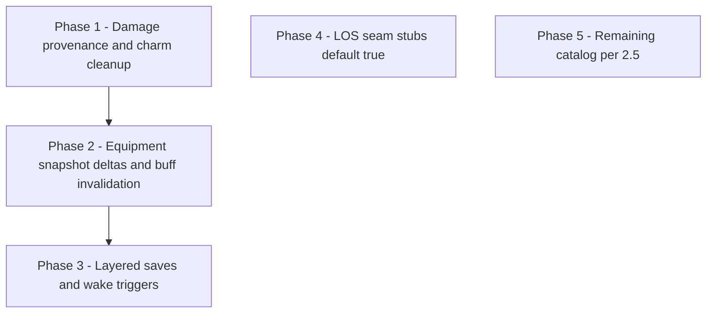

# Plan: Extend engine for Engine-blocked authoring

## Out of scope (explicit)

- **Spatial area targeting** — No roadmap work for geometry, templates, mixed allegiance in zone, or moving areas. Authored `creatures-in-area` + `area` remains a rules/UI template; the adapter continues to map area-style spells to `**all-enemies`** per [effects.md §3](../docs/reference/effects.md#area-targeting-and-encounter-combat-limitations). Revisit only if the product commits to grid/simulation.

---

## 1. What “Engine-blocked authoring” means

**Authoring** is *engine-blocked* when the canonical effect vocabulary and container metadata can represent part of a rule, but the encounter (or stat) resolution layer cannot yet enforce the remainder without lying in structured data.

The codebase already supports the *authoring side* of this pattern:

| Mechanism                               | Role                                                                   | Reference                                                                            |
| --------------------------------------- | ---------------------------------------------------------------------- | ------------------------------------------------------------------------------------ |
| `note` with `category: 'under-modeled'` | Explicit temporary gap on the spell                                    | [effects.md §8](../docs/reference/effects.md#8-intentional-under-modeling)           |
| `resolution.caveats`                    | Free-text when categorised notes are insufficient                      | [effects.md §9](../docs/reference/effects.md#9-scaling-direction)                    |
| `getSpellResolutionStatus` → `partial`  | Signals structured effects + remaining gaps                            | [spellResolution.ts](../src/features/content/spells/domain/types/spellResolution.ts) |
| Adapter degradation                     | Unsupported kinds log cleanly; content is not reshaped to fake support | [effects.md §10](../docs/reference/effects.md#10-adapter-philosophy)                 |

**Principle (from [effects.md §2](../docs/reference/effects.md#2-core-rules)):** runtime limits must not shape authored content. Engine work *unblocks* authoring cleanup: replace `under-modeled` notes with structure, trim `caveats`, and watch `partial` → `full`.

This plan is the **engine extension roadmap** that pairs with that content policy. It consolidates the follow-up backlog from [spells, caveats, See Invis](spells,_caveats,_see_invis_d60f643b.plan.md) §Engine-blocked authoring and aligns with [resolution.md §4.5](../docs/reference/resolution.md#45-condition-consequence-framework), [§9](../docs/reference/resolution.md#9-known-pressure-points), and [effects.md §10 “Known Unsupported Spell Mechanics”](../docs/reference/effects.md#known-unsupported-spell-mechanics).

---

## 2. Current blocked themes → engine capabilities

Each row: *what content does today* → *what must exist in the engine* → *primary modules / seams*.

### 2.1 Damage pipeline: provenance, allies, and conditional cleanup

**Today:** Charm Person documents early end when caster/allies damage the target via `resolution.caveats`; no hook removes `charmed` from damage context. See spells plan backlog.

**Engine needs:**

- **Damage events** that carry: source combatant, ability/spell linkage, and **ally side** relative to victim (instance graph or party/side on `CombatantInstance`).
- A **post-damage** (or inline) hook: if victim has `charmed` with `sourceInstanceId` matching charmer, and attacker is charmer or ally of charmer, **remove** the charm marker (and log).

**Primary seams:** `applyDamageToCombatant` in [damage-mutations.ts](../src/features/mechanics/domain/encounter/state/damage-mutations.ts), condition removal APIs in condition-mutations.

**Unblocks:** Caveat removal for Charm Person; pattern reuse for other “damage from X ends effect” rules.

---

### 2.2 Scripted saves, wake triggers, and turn-boundary semantics

**Today:** Sleep uses structured save + condition + `under-modeled` note for second save → unconscious, wake rules, immunities. Repeat-save exists for simple save-or-end at turn boundary ([resolution.md §5 repeat saves](../docs/reference/resolution.md#adding-repeat-saves)).

**Engine needs:**

- **Multi-step condition scripts** (e.g. first failed save → interim state; second failed save at turn boundary → unconscious) or composed markers + hooks.
- **Wake triggers:** damage to sleeping target, shake action, etc.
- Optional **save immunity predicates** (race/features/exhaustion) evaluated in save resolution.

**Unblocks:** Tightening Sleep notes; other layered save sequences (Flesh to Stone-style success/failure tracking per [effects.md Known Unsupported](../docs/reference/effects.md#known-unsupported-spell-mechanics)). **Spatial “who is in the patch” remains out of scope** — encounter still uses adapter targeting; notes/caveats stay honest where the grid differs.

---

### 2.3 Equipment snapshot (characters + monsters), live updates, and buff invalidation

**Today:** Mage Armor gates on `equipment.armorEquipped` at apply time; “ends if target dons armor” during the spell is not enforced; encounter loadout is snapshotted at combatant build. Spells plan backlog.

**Direction — one shared equipment shape for PCs and monsters**

- Prefer a **single robust snapshot** on `CombatantInstance` (and the same facts in `EvaluationContext` for condition gates) so effect `condition` predicates do not fork by creature kind.
- `**armorEquipped`:** keep as today (id or null) — eligibility for “not wearing armor,” Mage Armor, Draconic-style gates.
- `**weaponsEquipped` (or equivalent slots):** model explicitly (e.g. main hand / off hand item ids or structured “has weapon in hand” flags), not only armor. Many future effects will care (Somatic with hands full, future weapon-based conditions, narrative “holding a shield”).
- **Characters:** populate from loadout/builders (same source as stat resolution eventually uses).
- **Monsters:** populate from stat block metadata when present; otherwise safe defaults (often unarmored, natural weapons) — same fields, possibly sparser data.

**Effort (thoughts):** Defining the **shape once** (`equipment: { armorEquipped?, mainHand?, offHand?, … }` or a small normalized struct) is a modest refactor relative to bolting on armor-only now and splitting later. The larger recurring cost is **content**: tagging monsters and items consistently, not duplicate resolver logic. Wiring `evaluateCondition` for `equipment.`* already exists for PCs; extending snapshot fields and monster population is incremental if the type is stable early.

**Engine needs (behavior):**

- **Equipment change events** in encounter (or sync from character loadout) updating the snapshot.
- **Invalidation** of linked `statModifiers` / states when eligibility fails (same pattern as concentration-linked markers).

**Unblocks:** Mage Armor caveat; any buff keyed off equipment state over time; future weapon/armor gates without a second model.

---

### 2.4 Visibility / line of sight — seam only (full LOS/position not in scope)

**Today:** See Invisibility paired attack mods are handled; full spell text still references broader sight rules. `canSee` exists; [resolution.md §4.5](../docs/reference/resolution.md#46-debug-logging) lists visibility as seam without full consumer.

**Not ready to model** real line of sight, positions, or stealth grids.

**Near-term approach:**

- Introduce a **narrow seam** used by resolution when we need a hook point, e.g. `canSeeForTargeting(attacker, defender, state): boolean` or `lineOfEffectClear(...)`, implemented to `**return true` everywhere** (or “true unless blinded/invisible rules already handled elsewhere”).
- **Document** in code + [resolution.md](../docs/reference/resolution.md) that this is a **compatibility stub**; real LOS consumes the same function later without rewiring every call site.
- Optional: pass through **blinded** / **heavily obscured** when those are represented as flags before full geometry exists.

**Unblocks:** Clean insertion points for frightened “while in sight” and future stealth without committing to simulation now.

---

### 2.5 Catalog-wide “Known Unsupported” — revised assumptions (effects.md §10)

Engine-blocked authoring still reconciles when features land. **Deliberately deferred** in this plan:

| Theme                                                | Plan                                                                                                                                                                                                                                                                                                                                                                                                                                                                                               |
| ---------------------------------------------------- | -------------------------------------------------------------------------------------------------------------------------------------------------------------------------------------------------------------------------------------------------------------------------------------------------------------------------------------------------------------------------------------------------------------------------------------------------------------------------------------------------- |
| **Spell slots vs spell level**                       | Do **not** model slot consumption / slot-based scaling in this roadmap. Authored spell `level` is **0** for cantrips. For any formula that multiplies by spell level and needs a positive tier, use `**effectiveSpellLevelForScaling`** (`shared.ts`): **0 → 1**; leveled spells keep 1–9. Character-level cantrip damage still uses `**levelScaling` / `cantripDamageScaling`**, not this helper. **Document** slot-based upcasting as future work in [effects.md](../docs/reference/effects.md). |
| **Healing upcasting**                                | Same: when implemented, read slot or explicit “cast at level”; until then, documented assumption only.                                                                                                                                                                                                                                                                                                                                                                                             |
| **Moving areas, multi-area, spatial awareness**      | Remain **under-modeled** in content. **Assume chosen target(s) are in range** and valid per the simplified adapter; do not build multi-template or moving-effect entities in this plan.                                                                                                                                                                                                                                                                                                            |
| Charmed save advantage (allies fighting)             | Contextual save modifiers from battlefield state — still on backlog when prioritized                                                                                                                                                                                                                                                                                                                                                                                                               |
| Form changes                                         | Stat block swap / `form` resolution path                                                                                                                                                                                                                                                                                                                                                                                                                                                           |
| Caster choice at cast time                           | Cast-time selection UI → payload on action                                                                                                                                                                                                                                                                                                                                                                                                                                                         |
| Success/failure tracking (Flesh to Stone, Contagion) | Persistent counters on marker or combatant                                                                                                                                                                                                                                                                                                                                                                                                                                                         |

Prioritize by **content volume × player impact**, not list order.

---

## 3. Phased roadmap (recommended order)

Phases build dependencies: later phases assume earlier seams exist or are stubbed.

Phases 4–5 have no hard dependency on the chain above: Phase 4 is a parallel stub; Phase 5 is opportunistic backlog items.

| Phase | Scope                                                                      | Exit criteria (examples)                                                                                       |
| ----- | -------------------------------------------------------------------------- | -------------------------------------------------------------------------------------------------------------- |
| **1** | Damage pipeline metadata + charm removal hook                              | Unit/integration test: ally damages charmed target → charm removed per spell id                                |
| **2** | Unified equipment snapshot updates + invalidate Mage Armor–style modifiers | Test: don armor → AC modifier from spell drops; weapons fields present for PCs/monsters (monsters may default) |
| **3** | Sleep-class scripts + wake; extend repeat-save if needed                   | Sleep `under-modeled` note reduced where engine covers it; spatial honesty still via notes                     |
| **4** | LOS / visibility **seam** functions default `true`, documented             | Call sites exist for future frightened/sight rules; no grid                                                    |
| **5** | Itemised §2.5 backlog (form, caster choice, counters, contextual saves)    | Per-feature specs; `partial` → `full` as each lands                                                            |

**Note:** Phase 4 can land early in parallel with 2–3; it does not require equipment. Document spell-level vs slot assumptions alongside adapter changes when touching healing/scaling.

---

## 4. Reconciliation process (when the engine catches up)

For each shipped capability:

1. **Identify** spells/effects that cited this gap in `under-modeled` notes or `resolution.caveats` (grep / catalog audit).
2. **Author** the new structure; remove or narrow free-text.
3. **Run** `getSpellResolutionStatus` — expect `partial` → `full` when no `under-modeled` notes and no caveats remain.
4. **Update** [effects.md Known Unsupported](../docs/reference/effects.md#known-unsupported-spell-mechanics) — move items to “resolved since” bullets (existing pattern in that section).
5. **Trim** [spells plan](spells,_caveats,_see_invis_d60f643b.plan.md) §Engine-blocked backlog bullets.

Optional hardening: a **machine-readable** registry (e.g. caveat id → engine issue) is out of scope unless the team wants automated staleness checks; until then, docs + grep are the source of truth.

---

## 5. Anti-patterns to preserve

- Do **not** encode fake precision in effects to satisfy today’s adapter ([effects.md §11](../docs/reference/effects.md#11-anti-patterns)).
- Do **not** remove `under-modeled` / `caveats` until the engine actually enforces the rule (status `partial` is informative).
- Prefer **one shared primitive** when a gap repeats ([effects.md §14 Extension Policy](../docs/reference/effects.md#14-extension-policy)).

---

## 6. Related files

| Area                     | File(s)                                                                                      |
| ------------------------ | -------------------------------------------------------------------------------------------- |
| Spell resolution status  | `src/features/content/spells/domain/types/spellResolution.ts`                                |
| Combat actions / adapter | `src/features/encounter/helpers/spell-combat-adapter.ts`, `spell-resolution-classifier.ts`   |
| Action resolution        | `encounter/resolution/action/action-resolver.ts`, `action-effects.ts`, `action-targeting.ts` |
| Damage                   | `encounter/state/damage-mutations.ts`                                                        |
| Conditions               | `encounter/state/condition-mutations.ts`, `condition-rules/`*                                |
| Reference docs           | `docs/reference/effects.md`, `docs/reference/resolution.md`                                  |

---

## 7. Backlog migration from spells plan (initial checklist)

Copy status here or delete from the spells plan once tracked:

- Charm Person — damage pipeline + ally graph + charm removal
- Sleep — layered saves, wake, immunities (spatial parts stay under-modeled; adapter unchanged)
- Acid Splash — remains honest notes/caveats for adapter vs area wording; **no spatial engine work**
- Mage Armor — equipment change + linked modifier cleanup; unified armor + weapon snapshot for PCs/monsters
- See Invisibility — LOS seam + future real implementation; **full LOS/position still deferred**
- Area spells generally — **out of scope** for this plan; document in effects/resolution only

When a box checks, update spell data and docs per §4.