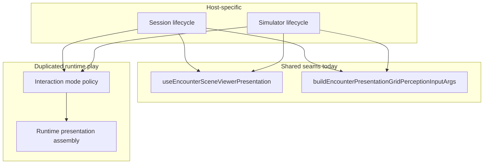

# Host presentation pipeline drift reduction

## Why these names (future-proofing)

| Older / brittle framing | Issue | Refined framing |
| ----------------------- | ----- | --------------- |
| “Active encounter” / route-era vocabulary | Anchors the seam to legacy route splits (`EncounterActive*`) that may not match how play is composed long-term | **Encounter runtime** — play-time behavior tied to `EncounterState` and hosts, not a specific route name |
| “Grid + header” / `GridAndHeader` in hook names | Names the **current** pair of composed outputs; new UI (footer, prompt strip, rails) would force renames or misleading APIs | **Runtime presentation** — the stable concern is *composing what the play shell needs to render*; today that includes grid VM and header model; the seam can absorb more outputs without a rename |
| `useEncounterPresentationGridAndActiveHeader` | Doubles down on implementation detail + `Active` | **`useEncounterRuntimePresentation`** — responsibility-based, room to grow |

The **host vs shared** boundary is unchanged: hosts own persistence, seat resolution, simulator setup/POV state, and callbacks; shared hooks own drift-prone **runtime** policy and presentation assembly.

---

## 1. Audit summary

### Still duplicated (same concept, two hosts)

| Area | [GameSessionEncounterPlaySurface.tsx](src/features/game-session/components/GameSessionEncounterPlaySurface.tsx) | [EncounterRuntimeContext.tsx](src/features/encounter/routes/EncounterRuntimeContext.tsx) (`useEncounterRuntimeValue`) |
| ---- | ---------------------------------------------------------------------------------------------------------------- | ---------------------------------------------------------------------------------------------------------------------- |
| **Interaction mode vs turn / AOE** | `prevActiveCombatantId` ref, sync `interactionMode` to `select-target` on turn change; effects for `aoe-place` when area action | Same pattern (variable naming differs) |
| **`selectedAction`** | `useMemo` from `availableActions` + `selectedActionId` | Same |
| **Runtime presentation wiring** | Sequential `useEncounterGridViewModel` then `useEncounterCombatActiveHeader` with parallel args | Same |
| **Play surface deps** | Manual object matching [`EncounterActivePlaySurfaceDeps`](src/features/encounter/hooks/useEncounterActivePlaySurface.tsx) | Simulator route passes full `runtime` from context (call site is thin; **value** still built with the same inner pipeline) |

*Note: Existing implementation hooks and types in the codebase may still use historical names (e.g. `useEncounterCombatActiveHeader`, `EncounterActivePlaySurfaceDeps`). The **new** shared seams use runtime/presentation language; internal delegates can keep current names until a separate rename pass.*

### Already centralized (not duplicated logic)

- Scene viewer: [`useEncounterSceneViewerPresentation`](src/features/encounter/hooks/useEncounterSceneViewerPresentation.ts)
- Perception args: [`buildEncounterPresentationGridPerceptionInputArgs`](src/features/encounter/domain/buildEncounterPresentationGridPerceptionInputArgs.ts) + `deriveEncounterPresentationGridPerceptionInput`

### Same concept, different encoding (drift risk)

- **`viewerContext` + POV**: session vs simulator policy — **intentional** host inputs to any shared seam.
- **Header-adjacent callbacks** (`onEditEncounter`, `onSimulatorViewerModeChange`, etc.) — host-specific.
- **`contextualPromptEnvironment`** — host-specific location/session shape.

### Truly host-specific (should remain in hosts)

**Session:** persisted combat fetch/revision sync, seat resolution, hydration, lobby navigation, `useGameSessionSync`, loading/error UI, session `contextualPromptEnvironment`.

**Simulator:** roster/setup modals, simulator POV / presentation-selection state, start/reset navigation, environment setup, `EncounterRuntimeModals`, context API surface.

### Main drift risks

1. **Interaction-mode block** — duplicated; easy to fix one host only.
2. **Runtime presentation assembly** — duplicated sequential composition; new presentation fields require mirrored edits.
3. **Play-surface deps** — session manually mirrors runtime shape when adding fields.

---

## 2. Architecture recommendation

- **Step A — `useEncounterRuntimeInteractionMode`** — Shared **encounter runtime interaction-mode** policy (grid targeting vs AOE placement vs defaults on turn change). Same behavior for session and simulator hosts; not tied to route naming.
- **Step B — `useEncounterRuntimePresentation`** (in scope) — Single **encounter runtime presentation composition seam**: accepts **`EncounterRuntimePresentationInput`** (typed bundle of encounter fields, perception input, viewer context, scene strip slot, host callbacks, catalog refs, etc.). **Today** it composes outputs needed for the play shell by delegating to existing hooks (e.g. `useEncounterGridViewModel`, `useEncounterCombatActiveHeader`); **later** the same seam can expose additional presentation outputs (prompt strip, rails, footer) without renaming the hook—only extending the input/return types.
- **Typed input** — `EncounterRuntimePresentationInput` documents the contract for hosts; optional internal grouping if it clarifies without hiding differences.
- **Do not** merge simulator setup UI or session persistence into these hooks.

---

## 3. Refactor plan

### Step A — `useEncounterRuntimeInteractionMode`

- **New file:** e.g. [`src/features/encounter/hooks/useEncounterRuntimeInteractionMode.ts`](src/features/encounter/hooks/useEncounterRuntimeInteractionMode.ts)
- **Responsibility:** `interactionMode` / `setInteractionMode`; reset toward `select-target` when the acting combatant changes; effects for `aoeStep` + area actions (`isAreaGridAction`).
- **Inputs:** `activeCombatantId`, `aoeStep`, `selectedAction`, `selectedCasterOptions` (minimal).
- **Output:** `{ interactionMode, setInteractionMode }`
- **Callers:** Both hosts replace their duplicated blocks.

### Step B — `useEncounterRuntimePresentation` (in scope)

- **New hook** + **`EncounterRuntimePresentationInput`** type:
  - Bundles everything hosts currently pass into the sequential presentation pipeline (authoritative + presentation encounter state, perception input, `viewerContext`, simulator POV props for header chrome, `sceneViewerSlot`, turn/action handlers, suppress flags, spells/monsters, etc.).
  - **Returns** (today): `gridViewModel`, `combatantViewerPresentationKindById`, `activeHeader`, `capabilities`, `encounterDirective`, `contextStripTitleTone`—i.e. what the play surface and shell need from this layer. Return type can be named e.g. `EncounterRuntimePresentationResult` if useful; field names may still reflect current consumers until those types are renamed separately.
- **Implementation:** Delegates to existing `useEncounterGridViewModel` then `useEncounterCombatActiveHeader` in dependency order; no behavior change intended.
- **Evolution:** Additional presentation outputs can be added to the result object without renaming the hook.

### Step C — Documentation

- Brief subsection in [`docs/reference/combat/client/perception-pov.md`](docs/reference/combat/client/perception-pov.md) or adjacent doc: interaction-mode seam + runtime presentation seam; what remains host-local (play-surface dep assembly).

### Contract note

- Existing [`EncounterActivePlaySurfaceDeps`](src/features/encounter/hooks/useEncounterActivePlaySurface.tsx) remains the play-shell contract until a dedicated follow-up; new types should **align field semantics** with those hooks’ parameters to avoid parallel naming drift.

---

## 4. Implementation scope (this pass)

1. **Step A:** `useEncounterRuntimeInteractionMode` + export + tests; wire both hosts.
2. **Step B:** `useEncounterRuntimePresentation` + `EncounterRuntimePresentationInput` + tests; wire both hosts to replace hand-rolled presentation pipeline; preserve host callbacks and viewer policy.
3. **Docs:** Describe both seams and remaining duplication.

**Out of scope:** Play-surface deps builder for session; renaming `EncounterActivePlaySurface` / `useEncounterCombatActiveHeader` files (can be a later pass); changing `EncounterRuntimeContextValue` beyond what Step B needs.

---

## 5. Acceptance criteria mapping

| Criterion | How met |
| --------- | ------- |
| No `EncounterActive` as the naming model for **new** seams | New hooks/types use **runtime** / **runtime presentation** language |
| Step B not named after grid+header | **`useEncounterRuntimePresentation`** + **`EncounterRuntimePresentationInput`** |
| Durable architectural seams | Names survive additional presentation outputs |
| Host vs shared preserved | Table in “Why these names” + host-specific sections unchanged in intent |
| Plan intent preserved | Same steps A/B/C, refined vocabulary only |
