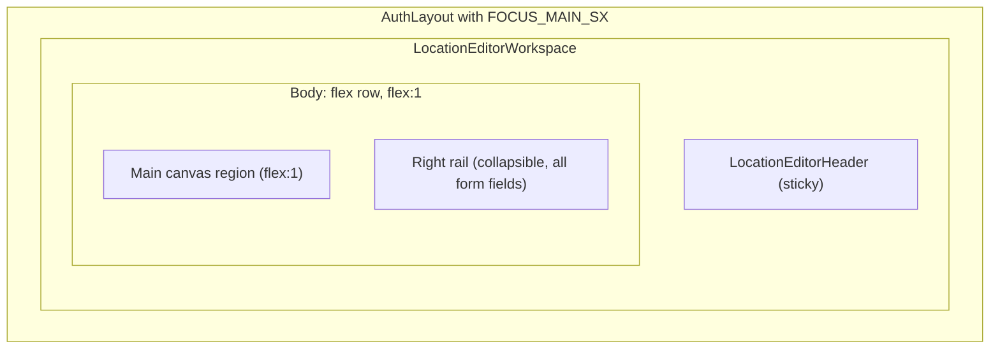

# Location Map Workspace Shell (Phase 1)

## Current state

Both `LocationCreateRoute` and `LocationEditRoute` render inside `[EntryEditorLayout](src/features/content/shared/components/EntryEditorLayout.tsx)` -- a narrow, form-centric scaffold with a page header, stacked form fields, and bottom save/cancel buttons. The grid authoring section (`LocationGridAuthoringSection`) renders inline within the form stack. Routes render under the standard `AuthLayout` chrome (sidebar + top bar).

## Architecture

The workspace shell follows the same flex-column pattern used by `[EncounterActiveRoute](src/features/encounter/routes/EncounterActiveRoute.tsx)`, adapted for a two-region authoring layout (canvas + collapsible right rail):




## New files

All under `src/features/content/locations/components/workspace/`:

- `**locationEditor.constants.ts**` -- reusable layout constants (header height, right rail width)
- `**LocationEditorWorkspace.tsx**` -- outer shell: column flex with header slot + row flex body with canvas and right rail
- `**LocationEditorHeader.tsx**` -- sticky header: title, ancestry breadcrumbs, save/back actions, right rail toggle
- `**LocationEditorCanvas.tsx**` -- canvas wrapper with `position: relative`, `overflow: hidden`; renders children (GridAuthoringSection for now); leaves room for future ZoomControl overlay
- `**LocationEditorRightRail.tsx**` -- fixed-width, vertically collapsible panel containing all form fields
- `**LocationAncestryBreadcrumbs.tsx**` -- reusable ancestry display built from `locations` list + `parentId` chain; lives here initially but designed to be liftable
- `**index.ts**` -- barrel

## Modified files

- `**[auth-main-path.ts](src/app/layouts/auth/auth-main-path.ts)**` -- extend regex to match location create/edit paths
- `**[LocationCreateRoute.tsx](src/features/content/locations/routes/LocationCreateRoute.tsx)**` -- replace `EntryEditorLayout` with `LocationEditorWorkspace`
- `**[LocationEditRoute.tsx](src/features/content/locations/routes/LocationEditRoute.tsx)**` -- replace `EntryEditorLayout` with `LocationEditorWorkspace`
- `**[src/features/content/locations/components/index.ts](src/features/content/locations/components/index.ts)**` -- re-export workspace barrel

## Detailed design

### A. Opt location create/edit into AuthMainFocus

`[auth-main-path.ts](src/app/layouts/auth/auth-main-path.ts)` currently only matches encounter active. Extend the regex:

```typescript
export function isAuthMainFocusPath(pathname: string): boolean {
  return (
    /\/campaigns\/[^/]+\/encounter\/active/.test(pathname) ||
    /\/campaigns\/[^/]+\/world\/locations\/new/.test(pathname) ||
    /\/campaigns\/[^/]+\/world\/locations\/[^/]+\/edit/.test(pathname)
  )
}
```

This strips the sidebar and top AppBar, giving the workspace full viewport width/height with `FOCUS_MAIN_SX`.

### B. Layout constants (`locationEditor.constants.ts`)

```typescript
export const LOCATION_EDITOR_HEADER_HEIGHT_PX = 64
export const LOCATION_EDITOR_RIGHT_RAIL_WIDTH_PX = 380
```

These mirror the pattern from encounter (`ENCOUNTER_ACTIVE_HEADER_LAYOUT_HEIGHT_PX`). The header height is a reusable constant referenced by the right rail height calculation.

### C. LocationEditorWorkspace (shell)

Props:

- `header: ReactNode` -- the header region
- `canvas: ReactNode` -- main canvas region
- `rightRail: ReactNode` -- form/settings region

Structure:

- Outer: `Box` with `display: flex`, `flexDirection: column`, `height: '100%'`
- Header slot: rendered at top
- Body: `Box` with `display: flex`, `flex: 1`, `minHeight: 0`, `overflow: hidden`
  - Canvas: `flex: 1`, `position: relative`, `overflow: hidden`
  - Right rail: rendered as-is (collapse behavior is owned by `LocationEditorRightRail`)

### D. LocationEditorHeader

Props:

- `title: string` -- location name or "New Location"
- `ancestryBreadcrumbs?: ReactNode` -- ancestry trail beneath title
- `saving: boolean`
- `dirty: boolean`
- `isNew: boolean`
- `formId?: string` -- for submit button to target
- `onSave?: () => void` -- fallback when no formId
- `onBack: () => void`
- `errors: ValidationError[]`
- `success: boolean`
- `rightRailOpen: boolean` -- current collapse state of the right rail
- `onToggleRightRail: () => void` -- callback to toggle right rail visibility

Renders:

- Sticky `Box` at header height from constant
- Left cluster: back icon button + title (`Typography variant="h6"`) + ancestry line beneath
- Right cluster: right rail toggle icon button + feedback alerts (inline) + save `Button` (wired via `formId` or `onSave`)
- Bottom border divider
- The toggle button uses an appropriate MUI icon (e.g. `ViewSidebar` / `ViewSidebarOutlined`) to indicate open/closed state

### E. LocationEditorCanvas

Thin wrapper:

- `Box` with `flex: 1`, `position: relative`, `overflow: hidden`, `display: flex`, `alignItems: center`, `justifyContent: center`
- Renders `children` -- in phase 1, this will be the existing `LocationGridAuthoringSection`
- Leave a `{/* ZoomControl slot */}` comment indicating where the floating control will go (absolute positioned, bottom-left of canvas, same pattern as encounter)
- The `position: relative` on this container is critical -- it becomes the positioning context for future absolute/fixed overlays (ZoomControl, tool palettes)

### F. LocationEditorRightRail

Props:

- `children: ReactNode` -- all form fields (ConditionalFormRenderer, VisibilityField, etc.)
- `open: boolean` -- whether the rail is expanded; **default prop value is `true`**
- `width?: number` -- override for rail width (defaults to `LOCATION_EDITOR_RIGHT_RAIL_WIDTH_PX`)

Collapse behavior:

- When `open` is `true`: renders at full width with content visible
- When `open` is `false`: width transitions to 0, content hidden with `overflow: hidden`
- CSS transition on width for smooth animation (`transition: 'width 200ms ease-in-out'`)
- The collapse state is controlled by the parent (route) via a `useState`, toggled from the header

Renders:

- `Box` with fixed width (from prop or constant), `overflow-y: auto`, border-left divider
- Height: `calc(100vh - HEADER_HEIGHT_PX - MUI_GUTTER*2)` as specified
- Padding for comfortable field spacing
- Contains **all** form fields: the `<form>` tag wrapping `ConditionalFormRenderer`, `VisibilityField`, and any other current location fields
- On edit with system patch mode: receives the patch-mode `ConditionalFormRenderer` with driver props instead

### G. LocationAncestryBreadcrumbs

A reusable component, not tied to form state:

- Props: `locations: Location[]`, `currentLocationId?: string` (on edit), `parentId?: string`
- Walks the `parentId` chain using a location map (same approach as `formatAncestryDescription` in `[LocationGridCellModal.tsx](src/features/content/locations/components/LocationGridCellModal.tsx)`)
- Renders MUI `Breadcrumbs` with location names as links (navigable to detail routes)
- On create: shows nothing or just campaign context
- On edit: shows the ancestor chain leading to the current location
- Designed to be liftable to a shared location outside the workspace if needed later

### H. Route migration: LocationCreateRoute

Replace the current return block. The route keeps all its hooks and logic but renders:

```
LocationEditorWorkspace
  header = LocationEditorHeader (title="New Location", isNew=true, formId, rightRailOpen, onToggleRightRail, ...)
  canvas = LocationEditorCanvas > LocationGridAuthoringSection (when showMapGridAuthoring)
  rightRail = LocationEditorRightRail (open=rightRailOpen) > <form> + ConditionalFormRenderer + VisibilityField
```

The form `id` stays the same (`location-create-form`). The submit button in the header uses `type="submit" form={formId}`.

The route owns a `const [rightRailOpen, setRightRailOpen] = useState(true)` and passes it down.

### I. Route migration: LocationEditRoute

Same pattern as create, with edit-specific differences:

- Title: `loc.name`
- Ancestry breadcrumbs populated from `locations` + `loc.parentId`
- Delete action in header (if `canDelete`)
- System entry patch flow preserved -- when `isSystem && driver`, the right rail renders the patch-mode `ConditionalFormRenderer` with driver props
- Loading/error states render before the workspace (same as current)
- Also owns `const [rightRailOpen, setRightRailOpen] = useState(true)`

### J. Future zoom/pan readiness

The canvas container structure is explicitly designed for later integration:

- `LocationEditorCanvas` provides the `position: relative` + `overflow: hidden` boundary
- `[ZoomControl](src/ui/patterns/ZoomControl/ZoomControl.tsx)` can be placed as an absolute-positioned child (bottom-left of canvas, unlike encounter which uses `position: fixed`)
- The grid content inside the canvas can later be wrapped in a transform container (`translate + scale`) driven by a reusable zoom hook
- A reusable drag/pan hook can attach pointer handlers to the canvas container
- No blocking layout decisions: the canvas is not constrained by max-width, the right rail doesn't overlap it, and the flex layout allows the canvas to grow

### K. What is NOT in scope

- Full zoom/pan hook extraction from EncounterActiveRoute
- Drag-to-pan behavior
- ZoomControl wiring
- Left rail (deferred to a future phase if needed)
- Map detail persistence changes
- LocationDetailRoute migration
- Object placement or cell authoring changes
- Transition work
- Server changes

### L. Recommended phase 2 abstractions

- `**useCanvasZoom` hook** -- extract from EncounterActiveRoute: zoom state, min/max/step, handlers. Shared by encounter and location editor.
- `**useCanvasPan` hook** -- extract from EncounterGrid: pointer-based drag state, transform calculation. Shared by both canvases.
- `**CanvasWorkspace` pattern component** -- generalize LocationEditorCanvas into a reusable canvas container (position:relative + overflow:hidden + optional ZoomControl slot + transform wrapper). Could eventually replace the ad-hoc Box structure in EncounterActiveRoute.
- `**WorkspaceHeader` pattern component** -- if more features adopt the workspace layout, the header could become a shared pattern.

