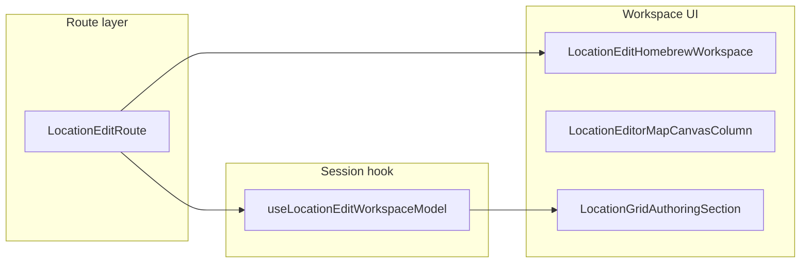

# Location workspace: orchestration cleanup (pre–feature work)

## Context

This plan implements **navigability and ownership clarity** for the location editor workspace. It **does not** replace [.cursor/plans/location-workspace/location_workspace_ownership_reorg.plan.md](.cursor/plans/location-workspace/location_workspace_ownership_reorg.plan.md) (subtree layout under `components/workspace/`) or [.cursor/plans/domain_ownership_restructure_94571363.plan.md](.cursor/plans/domain_ownership_restructure_94571363.plan.md) (domain vocabulary). It targets **orchestration thickness and traceability** so later plans (e.g. object authoring in the location-workspace bundle) land on a clearer structure.

**Canonical runtime behavior** remains [docs/reference/location-workspace.md](docs/reference/location-workspace.md). **Do not** change `LocationWorkspaceAuthoringContract`, `workspacePersistableSnapshot`, or normalization semantics unless a follow-up plan explicitly scopes persistence.

## Current pain (anchor files)


| Area                   | File                                                                                                                     | Approx. size | Issue                                                                                            |
| ---------------------- | ------------------------------------------------------------------------------------------------------------------------ | ------------ | ------------------------------------------------------------------------------------------------ |
| Canvas orchestration   | [LocationGridAuthoringSection.tsx](src/features/content/locations/components/workspace/LocationGridAuthoringSection.tsx) | ~1k lines    | Mixes tool modes, select-mode wiring, hex/square, overlays, draft updates                        |
| Workspace session hook | [useLocationEditWorkspaceModel.ts](src/features/content/locations/routes/locationEdit/useLocationEditWorkspaceModel.ts)  | ~1.2k lines  | Aggregates form, grid draft, map editor, palettes, zoom/pan, building/stairs, save, system patch |
| Route composition      | [LocationEditRoute.tsx](src/features/content/locations/routes/LocationEditRoute.tsx)                                     | ~500 lines   | Large inline JSX for map authoring / selection panels and related wiring                         |





---

## Ownership boundaries (use when deciding where code lives)

These rules prevent **arbitrary splits**, **helper dumping**, and **semantics leaking into the wrong layer**.

### `domain/authoring/editor/`

**Use for:**

- Pure **editor semantics** (modes, tool state rules where UI-agnostic)
- **Selection** resolution and policies (e.g. select-mode helpers already living here)
- **Placement**, **draw**, **paint**, **erase** logic that is **reusable and testable without React or route context**
- **Geometry-aware authoring behavior** that belongs with other grid/map editor rules
- **UI-agnostic rules** and pure functions

**Do not** put here:

- Route/session glue (campaign id, params, homebrew vs system-patch branching)
- Hydration, save, or dirty baseline concerns
- Anything that only exists to wire **this** route to **this** workspace shell

### `routes/locationEdit/`

**Use for:**

- **Workspace/session composition**: how the edit route assembles model, handlers, and workspace props
- **Route/model wiring**: reading params, campaign context, branching homebrew vs system
- **Hydration/save glue** and coordination with [useLocationEditSaveActions.ts](src/features/content/locations/routes/locationEdit/useLocationEditSaveActions.ts), [useLocationMapHydration.ts](src/features/content/locations/routes/locationEdit/useLocationMapHydration.ts)
- **Panel/rail assembly** driven by route-available data (see Phase 3)—discoverable orchestration, not domain semantics
- Colocated `**.helpers.ts`** modules that are still **session/route-shaped** (draft mutations tied to this editor flow, not reusable domain rules)

### `components/workspace/`

**Use for:**

- **Rendering** and **local UI composition** (shells, rails, toolbar, canvas column)
- **Presentational interaction structure** (props-driven subcomponents, layout)
- **Small UI-facing hooks/helpers** only when they are **clearly owned by a specific component** (e.g. local pointer wiring for a grid host)

**Do not** let this become:

- A second home for **reusable editor semantics** that belong in `domain/authoring/editor/`
- A dumping ground for “anything extracted from a big file” without a named concern

### How to tell if an extraction is a win

Prefer merging or skipping extractions that:

- Force readers to jump across **many files** to understand **one conceptual flow** (e.g. one tool mode end-to-end)
- Move **domain rules** next to **components** just to shrink line count
- Split a function across files **without** a stable, nameable seam (square vs hex, overlay assembly, select-mode bridge, etc.)

A good extraction **names a concern** and **reduces cognitive load** for that concern—not merely line count.

---

## Non-goals (this cleanup pass does not start)

- **Object authoring** palette/registry/toolbar product work (separate plans under the location-workspace bundle)
- **Edge placement** refactors or new placement modes beyond extraction for navigability
- **Broader map grid / geometry** reorganizations ([components/mapGrid/](src/features/content/locations/components/mapGrid/), [components/authoring/geometry/](src/features/content/locations/components/authoring/geometry/)) except where a Phase 1 extraction **naturally** touches an existing import path
- **Dirty/save contract** rewrites, snapshot shape changes, or normalization policy changes
- **Route-level product behavior changes** (new UX, new tools, new persistable fields)

This is a **pre-feature navigability and ownership pass** only.

---

## Phase 1 — `LocationGridAuthoringSection`: concern-based decomposition

**Goal:** Traceable **named concerns**, not a smaller file for its own sake.

**Valid extraction dimensions** (examples; use what matches the real code):

- **Square vs hex** rendering branch (grid host + overlay choice)
- **Overlay assembly** (SVG layers, wiring to draft)
- **Select / draw / place / paint / erase** mode event handling (group by mode where it clarifies flow)
- **Canvas / viewport** interaction interpretation (zoom/pan-related glue that stays presentational)
- **Pointer / click suppression** glue (`consumeClickSuppressionAfterPan`, pan vs commit boundaries)
- **Small presentational subcomponents** that reduce vertical scanning (e.g. a clearly named overlay or chrome subtree)

**Rule — avoid arbitrary fragmentation:**

Do **not** split the file into fragments that still require hopping across many files to understand **one concept** (e.g. “place mode on square”). If an extraction does not map to a **reviewer-defensible concern**, keep it inline or merge helpers.

**Ownership:** Prefer `**components/workspace/`** (and existing `mapGrid` / local authoring geometry imports) for UI structure. Push **pure, reusable editor behavior** to `**domain/authoring/editor/`** only when it is genuinely UI-agnostic (same rule as above).

**Stability:** Keep **public props** of `LocationGridAuthoringSection` stable for callers unless there is a strong, documented reason to change them.

**Optional directory shape:** A subfolder is justified only if it reflects **real containment** (e.g. `locationGridAuthoring/` with a thin entry file). See [Sample tree](#sample-tree-substantial-directory-changes) below.

---

## Phase 2 — `useLocationEditWorkspaceModel`: internal seams, stable external API

**Goal:** Thinner implementation with **clear internal modules**, without trading one god hook for **many sibling mini-hooks** whose ownership is opaque from [LocationEditRoute.tsx](src/features/content/locations/routes/LocationEditRoute.tsx).

**Preserve:**

- **One primary returned object** from `useLocationEditWorkspaceModel` (the main consumer contract)
- **Current top-level field names** unless there is a **very strong** reason and a deliberate migration (avoid churn)
- **Route readability**: the route should still read as “get model → pass props → render workspace,” not a fan-out across six hooks

**Preferred mechanisms:**

- **Colocated modules** under `routes/locationEdit/`: `*.helpers.ts`, `*.ts` for cohesive blocks (draft mutations, stair/building helpers) that are **session-shaped**
- **Internal** `useCallback` / `useMemo` groupings kept in the main file when extraction would obscure flow
- **Small number** of clearly named extractions—each maps to a **reviewable seam** (e.g. “map selection delete helpers,” not “lines 400–600”)

**Warning:** Avoid replacing the god hook with **many peer hooks** (`useX`, `useY`, `useZ`) all required by the route unless each hook has an obvious, stable responsibility and **does not** duplicate session lifecycle.

**Keep persistence seams concentrated:** Authoring contract assembly, hydration, and save coordination stay tied to [useLocationEditSaveActions.ts](src/features/content/locations/routes/locationEdit/useLocationEditSaveActions.ts) / [useLocationMapHydration.ts](src/features/content/locations/routes/locationEdit/useLocationMapHydration.ts) patterns—do not scatter baseline/save logic across new files without reason.

**Domain vs route:** Pure rules that are **editor-global** and testable without route → `**domain/authoring/editor/`**. Glue that needs `loc`, campaign, system vs homebrew → `**routes/locationEdit/`**.

---

## Phase 3 — Workspace panel / rail assembly (not “generic panels”)

**Goal:** **Discoverable ownership** for “where Map rail content and Selection rail content for location edit are assembled.” The **route** should not own large inline JSX trees for those concerns.

**Responsibility:**

- Extract **workspace map-authoring panel** and **selection panel** construction (and closely related JSX that is purely assembly) into **one dedicated module** under [routes/locationEdit/](src/features/content/locations/routes/locationEdit/)—e.g. `locationEditWorkspacePanels.tsx` or `LocationEditWorkspaceRailPanels.tsx` exporting component(s) or builders.
- Naming should signal **workspace rail assembly**, not a vague “utils” or “components” grab-bag.

**Stay in the route:**

- Params, router context, campaign id, `**buildStairWorkspaceInspect`**-style helpers that are **route-local**
- Branching **homebrew vs system** at the page level
- Passing **explicit props** into the assembly module—avoid hiding data loading or session creation inside the panel module

**Outcome:** A contributor looking for “where is the map tool panel for the rail built?” lands in **one module** (+ the route for wiring), not a 500-line route body.

---

## Phase 4 — `components/authoring` vs `domain/authoring` (minimal)

**Goal:** Clarify the **seam** without turning this phase into a **folder migration**.

**Start with:**

- Comments on [components/authoring/index.ts](src/features/content/locations/components/authoring/index.ts) (draft types, persist/compare, overlay geometry adapters vs editor semantics in `domain/authoring/`)
- Optional one-line pointer in [docs/reference/location-workspace.md](docs/reference/location-workspace.md) if confusion persists

**Only move files** if, after the above, **boundary confusion remains** in review or imports—then move the **smallest** set of files with a clear rule, not a broad reshuffle.

---

## Phase 5 — Optional polish

- Split [rightRail/types/](src/features/content/locations/components/workspace/rightRail/types/) so **types** and **helpers** are not mixed under a misleading folder name—only if the rename improves clarity at low cost.
- **Barrel hygiene:** Prefer targeted imports for new code; avoid expanding [domain/index.ts](src/features/content/locations/domain/index.ts) without need.

---

## Sample tree (substantial directory changes)

Illustrative only—**adopt pieces that match Phase 1–3 outcomes**; do not treat as mandatory layout.

```
src/features/content/locations/
├── routes/
│   └── locationEdit/
│       ├── useLocationEditWorkspaceModel.ts          # slimmer; delegates to helpers
│       ├── locationEditWorkspacePanels.tsx            # NEW: map + selection rail panel assembly
│       ├── mapSessionDraft.helpers.ts                 # NEW (example): route-shaped draft helpers
│       ├── useLocationEditSaveActions.ts              # unchanged responsibility
│       ├── useLocationMapHydration.ts
│       └── LocationEditRoute.tsx                      # thinner: wiring + branch to workspace
│
└── components/
    └── workspace/
        ├── LocationGridAuthoringSection.tsx            # thinner entry, or re-export only
        └── locationGridAuthoring/                      # OPTIONAL subtree if concern-based
            ├── LocationGridAuthoringSection.tsx
            ├── SquareLocationGridAuthoring.tsx         # example: square branch
            ├── HexLocationGridAuthoring.tsx            # example: hex branch
            ├── LocationGridAuthoringOverlays.tsx         # example: overlay assembly
            └── useLocationGridPointerBridge.ts         # example: viewport/pointer glue
```

If Phase 1 does **not** justify a new folder, keep new files **next to** `LocationGridAuthoringSection.tsx` with **explicit names** (e.g. `locationGridAuthoringSelectMode.tsx`) instead of inventing depth.

---

## Plan bundle hygiene

When a milestone lands, add a row to [.cursor/plans/location-workspace/README.md](.cursor/plans/location-workspace/README.md) linking this plan and a one-line summary (orchestration cleanup, concern-based extractions, pre–object-authoring).

---

## Success criteria

**Quantitative (necessary but not sufficient):**

- `LocationGridAuthoringSection` and `useLocationEditWorkspaceModel` are **smaller in a justified way** (no remaining ~1k-line file without a documented reason).
- **No unintended behavior change** to dirty/save, hydration, or authoring contract tests.

**Qualitative (required for “done”):**

- A contributor can find **where map-authoring rail panel assembly lives** in **≤2 files** (typically the new assembly module + the route).
- A contributor can trace a **mode-specific interaction path** (e.g. select vs place) without opening a **single ~1k-line file**—seams correspond to **named concerns**, not arbitrary chunks.
- Extractions **improve ownership clarity**: domain vs route vs workspace responsibilities are **easier to explain** after the pass, not muddier.

---

## Acceptance checklist (refinement complete)

- Plan is explicit about `**components/workspace`**, `**routes/locationEdit`**, and `**domain/authoring/editor**` (see [Ownership boundaries](#ownership-boundaries-use-when-deciding-where-code-lives)).
- Phases 1–2 are framed around **concern-based decomposition**, not line-count reduction alone.
- Phase 3 is clearly **workspace panel / rail assembly** ownership, with the route retaining route-only concerns.
- **Non-goals** block feature work and unrelated migrations from sneaking into this pass.
- **Success criteria** include **navigability and ownership**, not only file size.

