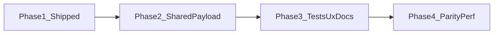
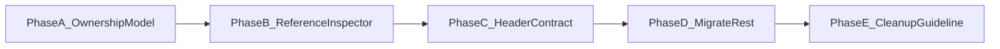

# Location map workspace: scalable dirty-state plan

## Phased roadmap

| Phase | Goal | Primary outcome |
| ----- | ---- | --------------- |
| **1** | Persistable snapshot + baseline | `isWorkspaceDirty`, [`workspacePersistableSnapshot.ts`](src/features/content/locations/routes/locationEdit/workspacePersistableSnapshot.ts), hydration/save baseline, [`location-workspace.md`](docs/reference/location-workspace.md) — **done** |
| **2** | Single source of truth | One builder for “what would be persisted” consumed by **both** dirty snapshot and `handleCampaignSubmit` — eliminates save vs dirty drift |
| **3** | Quality + rail UX | Table/matrix tests, contributor checklist in docs, explicit policy for nested **submit-to-commit** inspectors |
| **4** | Parity + polish | System patch rules documented or aligned; optional snapshot memoization if profiling says so |

---

## Current behavior (as implemented)

- **Campaign** edit header uses [`LocationEditRoute.tsx`](src/features/content/locations/routes/LocationEditRoute.tsx): `dirty={isWorkspaceDirty}` (persistable snapshot vs baseline from [`useLocationEditWorkspaceModel.ts`](src/features/content/locations/routes/locationEdit/useLocationEditWorkspaceModel.ts), [`workspacePersistableSnapshot.ts`](src/features/content/locations/routes/locationEdit/workspacePersistableSnapshot.ts)).
- **System** patch branch: `dirty={isSystemLocationWorkspaceDirty(driver.isDirty(), isGridDraftDirty)}` ([`systemLocationWorkspaceDirty.ts`](src/features/content/locations/routes/locationEdit/systemLocationWorkspaceDirty.ts)) — patch JSON dirty **or** grid draft dirty; **not** the campaign persistable snapshot (intentional).
- **`isGridDraftDirty`** remains for the system branch; campaign Save no longer relies on RHF `formState.isDirty` alone.
- **Save path (campaign):** [`handleCampaignSubmit`](src/features/content/locations/routes/locationEdit/useLocationEditSaveActions.ts) builds payloads via **`buildCampaignWorkspacePersistableParts`** (same helper as [`serializeLocationWorkspacePersistableSnapshot`](src/features/content/locations/routes/locationEdit/workspacePersistableSnapshot.ts)).

Rail tabs (**Location / Map / Selection**) are not separate stores: they feed the same `FormProvider` form, `gridDraft`, and (for buildings) `buildingStairConnections`. Tab-specific dirty flags are unnecessary if the **aggregate snapshot** (campaign) or **patch + grid** (system) is correct.

## Root causes this design fixes

1. **Split sources of truth** — Anything that is **saved** but **not** reflected in RHF `isDirty` or in `gridDraftPersistableEquals` will keep Save disabled. The save path already uses `**buildingStairConnectionsRef`** for building saves; that state lives **outside** the current `dirty` expression and is a **concrete gap** for “rail changed but Save stays off” whenever connections and normalized grid data do not both move (or when only the ref-relevant slice changes). A **single snapshot** that mirrors submit inputs removes this class of bug for future parallel state too.
2. **RHF `isDirty` fragility** — Conditional fields, programmatic `setValue` without `shouldDirty`, or subscription quirks can miss edits. Comparing `**getValues()`-derived persistable input** (same shape as save) is more reliable than trusting `isDirty` alone.
3. **Map draft compare is already normalized** — `[gridDraftPersistableEquals](src/features/content/locations/components/locationGridDraft.utils.ts)` + `[normalizedAuthoringPayloadFromGridDraft](src/features/content/locations/components/locationGridDraft.utils.ts)` are the right building blocks; extend them into a **workspace-level** compare, not new per-field listeners.

## Shipped design (summary)

**Campaign:** `buildCampaignWorkspacePersistableParts` feeds both [`handleCampaignSubmit`](src/features/content/locations/routes/locationEdit/useLocationEditSaveActions.ts) and [`serializeLocationWorkspacePersistableSnapshot`](src/features/content/locations/routes/locationEdit/workspacePersistableSnapshot.ts); baseline string is set after successful map hydration and after successful campaign save. **Dirty:** `isWorkspaceDirty` compares current snapshot to baseline.

**System:** `isSystemLocationWorkspaceDirty(patchDriver.isDirty(), isGridDraftDirty)` in [`systemLocationWorkspaceDirty.ts`](src/features/content/locations/routes/locationEdit/systemLocationWorkspaceDirty.ts) — not the campaign snapshot.

Full architecture, nested-form policy, and pointers **#8–#9** live in [`location-workspace.md`](docs/reference/location-workspace.md).

## Remaining risks and gaps (post-ship)

### In good shape

- **Campaign save vs dirty drift** is largely mitigated by the shared **`buildCampaignWorkspacePersistableParts`** path.
- **Contributor-facing** detail: [`location-workspace.md`](docs/reference/location-workspace.md) (campaign snapshot, system two-rule dirty, nested rails, whitespace, performance).

### Risks

| Risk | Notes |
| ---- | ----- |
| **New persistence without updating the builder** | If a field is persisted outside `buildCampaignWorkspacePersistableParts` / `toLocationInput` / map bootstrap, expect **false negatives** (Save stays off) or inconsistent dirty behavior. Mitigation: extend the shared builder and the checklist in `location-workspace.md`; no automated lint today. |
| **Hydration / grid layout ordering** | **False positives** after prune or dimension changes if draft and baseline update in different orders. Mitigate with baseline only at hydration/save boundaries; add focused tests when changing [`useLocationMapHydration.ts`](src/features/content/locations/routes/locationEdit/useLocationMapHydration.ts) or grid reset. |
| **Post-save baseline uses `loc`, not `updated`** | After campaign save, baseline serialization uses `loc` from closure while the form was reset from `updated`. [`mergeBuildingProfileForSave`](src/features/content/locations/routes/locationEdit/workspacePersistableSnapshot.ts) layers `loc.buildingProfile` under form input; **server-only** keys not in the form could theoretically skew the snapshot until the route refetches `loc`. Low risk if the form owns those fields. |
| **Whitespace / normalization** | Spacing-only edits may not dirty the snapshot if `toLocationInput` / normalization trims — documented in `location-workspace.md`. |
| **Performance** | Snapshot string is memoized in [`useLocationEditWorkspaceModel.ts`](src/features/content/locations/routes/locationEdit/useLocationEditWorkspaceModel.ts); broad `watch()` deps remain. Narrow only if profiling shows a hotspot. |

### Gaps (by design or follow-up)

| Gap | Notes |
| --- | ----- |
| **Nested submit-to-commit rails** | Edits that apply to `gridDraft` only on **panel Submit** are invisible to `isWorkspaceDirty` until then. **Target fix:** § [Refactor-first plan](#refactor-first-plan-make-workspace-draft-the-single-source-of-truth-for-persistable-edits) (Phases A–E): workspace-owned draft for persistable edits; avoid end-state “flush all panels on Save.” |
| **System vs campaign semantics** | Two models: **patch driver + grid draft** vs **full campaign persistable snapshot**. No unified “serialize like server” for system unless product requests a larger refactor. |
| **Test depth** | [`workspacePersistableSnapshot.test.ts`](src/features/content/locations/routes/locationEdit/workspacePersistableSnapshot.test.ts) matrix + [`systemLocationWorkspaceDirty.test.ts`](src/features/content/locations/routes/locationEdit/systemLocationWorkspaceDirty.test.ts); **no E2E** for header Save across full flows. |
| **Optional automation** | CI guard if save and snapshot builders diverge — not implemented. |

### Process

- Keep **Pointers for the next agent** in [`location-workspace.md`](docs/reference/location-workspace.md) linked to [`workspacePersistableSnapshot.ts`](src/features/content/locations/routes/locationEdit/workspacePersistableSnapshot.ts) and this plan.

## Key files (reference)

| Area | Files |
| ---- | ----- |
| Snapshot + builder | [`workspacePersistableSnapshot.ts`](src/features/content/locations/routes/locationEdit/workspacePersistableSnapshot.ts) |
| Workspace model | [`useLocationEditWorkspaceModel.ts`](src/features/content/locations/routes/locationEdit/useLocationEditWorkspaceModel.ts) |
| Save + baseline | [`useLocationEditSaveActions.ts`](src/features/content/locations/routes/locationEdit/useLocationEditSaveActions.ts) |
| Hydration + baseline | [`useLocationMapHydration.ts`](src/features/content/locations/routes/locationEdit/useLocationMapHydration.ts), [`hydrateDefaultLocationMap.ts`](src/features/content/locations/routes/hydrateDefaultLocationMap.ts) |
| Route wiring | [`LocationEditRoute.tsx`](src/features/content/locations/routes/LocationEditRoute.tsx) |
| System dirty helper | [`systemLocationWorkspaceDirty.ts`](src/features/content/locations/routes/locationEdit/systemLocationWorkspaceDirty.ts) |
| Tests | [`workspacePersistableSnapshot.test.ts`](src/features/content/locations/routes/locationEdit/workspacePersistableSnapshot.test.ts), [`systemLocationWorkspaceDirty.test.ts`](src/features/content/locations/routes/locationEdit/systemLocationWorkspaceDirty.test.ts) |
| Docs | [`location-workspace.md`](docs/reference/location-workspace.md) |
| Re-exports | [`routes/locationEdit/index.ts`](src/features/content/locations/routes/locationEdit/index.ts) |

---

## Refactor-first plan: make workspace draft the single source of truth for persistable edits

Follow-up work after Phases 1–4. **Ownership refactor**, not a full workspace rewrite.

### Goal

Refactor the location workspace so any **persistable** edit made in nested inspectors or rail panels lands in **workspace-owned draft state** before header Save. The header dirty state and Save action must become truthful without relying on panel-local submit buttons.

### Core rule

Adopt this rule across the workspace:

- If a field affects saved location/workspace data, edits must flow into workspace draft state.
- Local component state is only for ephemeral UI concerns (open/closed panels, hover, search, picker visibility, temporary preview state).
- Header dirty/save must derive from workspace draft vs persisted snapshot, not from scattered child-local forms.

### Scope guardrails

Keep this pass intentionally narrow.

**Do:**

- Refactor persistable nested inspector edits into workspace-owned draft state.
- Preserve existing workspace UX where possible.
- Migrate incrementally by inspector/slice.
- Add small adapter helpers where needed to bridge old local panel code to new draft writes.

**Do not:**

- Redesign the entire location workspace.
- Rebuild all forms under one giant RHF tree unless already necessary for the targeted slice.
- Mix this pass with object palette, edge-authoring, or broader tool redesign.
- Change persistence contracts unless required by the draft ownership refactor.
- Introduce a large imperative “flush all child panels on Save” architecture as the end state.

### Phase A — establish the ownership model

Define and document the new ownership boundary for workspace state.

**Implementation goals:**

- Identify the canonical workspace draft source(s) that represent persistable authoring state (for example `gridDraft` and any sibling draft slices if needed).
- Classify current state into:
  - persistable authoring state
  - ephemeral UI state
- Enumerate nested inspectors/panels that currently hold persistable edits locally until a panel Submit action.

**Deliverables:**

- A short ownership note in the plan describing which state belongs to workspace draft and which state may remain local.
- A migration list of affected inspectors, ordered by risk / frequency of use.

**Acceptance criteria:**

- There is a clear, shared rule for future work: persistable edits must not live only in local panel state.

### Phase B — refactor one representative inspector end-to-end

Choose the highest-value nested inspector that currently creates the dirty-state gap and use it as the reference implementation.

**Implementation goals:**

- Move its persistable fields to read/write through workspace draft.
- Keep ephemeral UI state local where appropriate.
- Remove dependence on panel-local Submit as the only way to commit persistable changes.
- Prefer immediate sync for discrete fields (toggle/select/choice).
- Prefer debounced sync for freeform text inputs if needed for ergonomics.

**Design guidance:**

- It is acceptable for workspace draft to temporarily contain incomplete or invalid in-progress values, as long as final save validation remains authoritative.
- If the inspector currently depends on a local “Cancel” model, redefine Cancel to discard only ephemeral unsaved UI changes, not revert already-applied workspace draft changes, unless there is a strong product reason to preserve full revert semantics.

**Acceptance criteria:**

- Editing this inspector updates workspace dirty state truthfully.
- Header Save reflects the current edited state without requiring panel Submit.
- Closing or switching away from the panel does not silently discard persistable work.

### Phase C — make header dirty/save depend on draft ownership only

Once the reference slice works, tighten the workspace contract.

**Implementation goals:**

- Ensure header dirty is derived from workspace draft vs persisted snapshot.
- Remove assumptions that panel-local submit is required before header Save can be trusted.
- Keep validation behavior explicit: draft may be dirty while save may still be blocked by validation.

**Design guidance:**

- Separate “dirty” from “valid.”
- Dirty means the draft differs from persisted state.
- Valid means the draft is currently saveable.
- Do not conflate these in the header model.

**Acceptance criteria:**

- Header Save is truthful for all migrated slices.
- Dirty-state computation no longer depends on hidden local panel state for migrated inspectors.

### Phase D — migrate remaining nested inspectors slice-by-slice

Apply the same ownership pattern to the rest of the affected rail inspectors.

**Implementation goals:**

- Migrate one inspector at a time.
- Reuse shared adapter/helpers for reading and writing draft slices.
- Reduce local form ownership to UI-only concerns.

**Suggested migration order:**

- Inspectors with the highest risk of silent data loss first.
- Then most frequently used authoring panels.
- Then lower-risk or more specialized panels.

**Acceptance criteria:**

- For each migrated inspector, persistable edits are visible to workspace dirty/save immediately or via intentional debounce.
- Panel-local submit buttons are removed, repurposed, or clearly no longer the only commit path.

### Phase E — remove transitional patterns and codify the standard

After the main inspectors are migrated, clean up any temporary compatibility logic.

**Implementation goals:**

- Remove stale “nested submit-to-commit” assumptions.
- Simplify panel APIs that existed only to support local commit workflows.
- Add a lightweight authoring guideline for future workspace panels.

**Authoring guideline should state:**

- Persistable field → workspace draft
- Ephemeral panel UI → local state
- Header dirty/save → workspace draft only
- Validation and dirty are separate concerns

**Acceptance criteria:**

- The workspace no longer has hidden persistable edits outside its canonical draft model.
- New panel work has a clear standard to follow.

### Transitional note during migration

During the migration window, not every inspector may be converted at once. For any still-unmigrated inspector:

- explicitly document that it still uses local commit semantics
- add temporary protection only if needed to prevent silent loss
- remove that protection once the inspector is migrated

**Important:** Treat such protections as temporary migration aids, not the target architecture.

### Success criteria for the overall refactor

This refactor is successful when all of the following are true:

- Header Save never misses meaningful persistable workspace edits for migrated panels.
- Dirty state is trustworthy because it is based on workspace-owned draft state.
- Nested inspectors are simpler in responsibility: they edit draft state rather than privately owning unsaved persistable data.
- The workspace has a durable state ownership rule that can support future richer tools (objects, edges, metadata, etc.) without reintroducing split dirty-state behavior.

