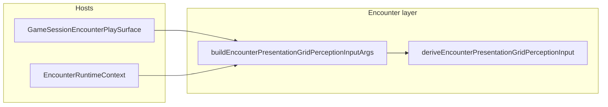

# Perception presentation policy seam

## Audit (answers to your questions)

### 1. What is truly shared?

Both hosts ultimately call `[deriveEncounterPresentationGridPerceptionInput](packages/mechanics/src/combat/presentation/perception/derive-encounter-presentation-grid-perception.ts)` with the same conceptual inputs:

- `**encounterState` for presentation** — `presentationEncounterState` (already scene-focus–resolved).
- `**simulatorViewerMode`** — maps presentation POV (`dm` | `active-combatant` | `selected-combatant`) to `GridPerceptionInput` (who is the “camera” for fog/veil).
- `**activeCombatantId`** — turn owner; used for `active-combatant` mode and DM fallbacks.
- `**presentationSelectedCombatantId`** — only meaningful when mode is `selected-combatant` (simulator) or for DM anchor resolution when mode is `dm`.

Mechanics already document this in `DeriveEncounterPresentationGridPerceptionInputArgs` and the function body (lines 66–112 in the same file).

### 2. What is intentionally different by product?

| Concern                           | Simulator                                                                                    | Session                                                |
| --------------------------------- | -------------------------------------------------------------------------------------------- | ------------------------------------------------------ |
| POV switching                     | Full UI: `simulatorViewerMode` state can be `active-combatant` / `selected-combatant` / `dm` | No POV switcher; policy is derived from **seat**       |
| `presentationSelectedCombatantId` | Seeded from target selection + simulator state                                               | **Always `null`** today (no session “view as” yet)     |
| DM omniscience                    | User can pick `dm` mode in toolbar                                                           | **Seat DM** should use `dm` presentation mode for grid |

These differences stay; they should be **encoded in one builder** with a discriminated `hostMode` (or equivalent), not re-expressed as ad hoc conditionals in each host.

### 3. Where updates would currently require lockstep changes (drift risk)

For **session**, the same policy is implied in **three** places today:

1. `[GameSessionEncounterPlaySurface.tsx](src/features/game-session/components/GameSessionEncounterPlaySurface.tsx)` — `deriveEncounterPresentationGridPerceptionInput({ simulatorViewerMode: viewerRole === 'dm' ? 'dm' : 'active-combatant', ... })`
2. Same file — `viewerContext` with `simulatorViewerMode: 'active-combatant'` **always** (misaligned with (1) for DM)
3. Same file — `useEncounterCombatActiveHeader({ ..., simulatorViewerMode: 'active-combatant' })`

`[useEncounterCombatActiveHeader.tsx](src/features/encounter/hooks/useEncounterCombatActiveHeader.tsx)` uses `**viewerContext.simulatorViewerMode`** for `[deriveEncounterPerceptionUiFeedback](packages/mechanics/src/combat/presentation/perception/encounter-perception-ui.feedback.ts)` (lines 124–137), not the hook’s `simulatorViewerMode` prop. So for session **DM**, grid perception uses `dm` but feedback still thinks `active-combatant` — wrong POV line (“Viewing as…” vs “DM overview”). Aligning (2) with the shared policy **fixes** that inconsistency.

**Simulator** is already internally consistent: `[EncounterRuntimeContext.tsx](src/features/encounter/routes/EncounterRuntimeContext.tsx)` uses the same `simulatorViewerMode` and `presentationSelectedCombatantId` for `viewerContext` and `deriveEncounterPresentationGridPerceptionInput` (lines 266–276 vs 309–317).

---

## Architecture recommendation

- **Canonical seam (new):** a small **pure** module under the encounter feature, e.g. `[src/features/encounter/domain/buildEncounterPresentationGridPerceptionInputArgs.ts](src/features/encounter/domain/buildEncounterPresentationGridPerceptionInputArgs.ts)` (name can vary slightly), exporting:
  - `**buildEncounterPresentationGridPerceptionInputArgs(...)`** — returns `[DeriveEncounterPresentationGridPerceptionInputArgs](packages/mechanics/src/combat/presentation/perception/derive-encounter-presentation-grid-perception.ts)` (import type from mechanics or re-export from `[src/features/encounter/domain/index.ts](src/features/encounter/domain/index.ts)`).
  - Discriminated input, e.g. `{ hostMode: 'session'; viewerRole; presentationEncounterState; activeCombatantId }` vs `{ hostMode: 'simulator'; simulatorViewerMode; presentationSelectedCombatantId; ... }`.
- **What stays host-specific:** fetching/hydration, seat resolution (`resolveGameSessionEncounterSeat`), simulator UI state (`simulatorViewerMode`, `setSimulatorViewerMode`), and wiring into `useEncounterGridViewModel` / `useEncounterCombatActiveHeader`.
- **DM omniscience:** Represent **once** for session as `simulatorViewerMode: 'dm'` when `viewerRole === 'dm'` in `**EncounterViewerContext`** and in the **same** args passed to `deriveEncounterPresentationGridPerceptionInput`. That matches the type contract in `[EncounterViewerContext](packages/mechanics/src/combat/selectors/capabilities/encounter-capabilities.types.ts)` (lines 28–36): presentation POV is exactly what feeds grid perception.
- `**presentationSelectedCombatantId`:** Builder makes session path **explicitly** pass `null` (with a short comment: “session POV selection not implemented”). Simulator path passes through state. Future session feature = extend the `session` branch in **one** place.

---

## Refactor plan (minimal churn)

1. **Add** `buildEncounterPresentationGridPerceptionInputArgs` (pure function + JSDoc) in `src/features/encounter/domain/`, covering:
  - **session:** `simulatorViewerMode = viewerRole === 'dm' ? 'dm' : 'active-combatant'`; `presentationSelectedCombatantId = null`.
  - **simulator:** pass through `simulatorViewerMode` and `presentationSelectedCombatantId` unchanged.
2. **Export** from `[src/features/encounter/domain/index.ts](src/features/encounter/domain/index.ts)`.
3. **Game session host** — replace inline `useMemo` calling `deriveEncounterPresentationGridPerceptionInput({...})` with the builder + single `derive` call.
4. **Align session `viewerContext`:** set `simulatorViewerMode` to the **same** session presentation mode the builder uses (so capabilities-adjacent copy and `deriveEncounterPerceptionUiFeedback` see `dm` when the grid does).
5. `**useEncounterCombatActiveHeader` call site (session):** pass `simulatorViewerMode` = that same derived value (not the literal `'active-combatant'`), keeping `onSimulatorViewerModeChange` as no-op.
6. **Simulator host** — replace the local `useMemo` with `deriveEncounterPresentationGridPerceptionInput(buildEncounterPresentationGridPerceptionInputArgs({ hostMode: 'simulator', ... }))` so both hosts share the seam even though simulator is a thin passthrough.
7. **Tests:** Add a focused unit test file next to the builder (e.g. `buildEncounterPresentationGridPerceptionInputArgs.test.ts`) asserting session DM vs player vs simulator passthrough.
8. **Docs (light):** One short JSDoc block on the builder stating: session derives presentation POV from seat; simulator from UI; `presentationSelectedCombatantId` session participation is intentionally `null` until product adds it.
9. **Reference documentation:** Add a **perception / POV** doc under `docs/reference/` (recommended path: `[docs/reference/combat/client/perception-pov.md](docs/reference/combat/client/perception-pov.md)`, alongside `[grid.md](docs/reference/combat/client/grid.md)` and `[encounter-viewer-permissions.md](docs/reference/combat/client/encounter-viewer-permissions.md)`). Content should cover at minimum:
  - How presentation POV relates to `EncounterViewerContext`, `deriveEncounterPresentationGridPerceptionInput`, and grid/header feedback (mental model for debugging).
  - Session vs simulator product differences (seat-derived vs UI POV; `presentationSelectedCombatantId` participation).
  - Where the canonical policy seam lives after the refactor (`buildEncounterPresentationGridPerceptionInputArgs` + hosts).
  - Cross-links to mechanics `derive-encounter-presentation-grid-perception` and scene-viewer presentation (`useEncounterSceneViewerPresentation`) so readers see the split of concerns.
  - Optional: one-line pointer from `[game-session.md](docs/reference/combat/game-session.md)` or `[client/overview.md](docs/reference/combat/client/overview.md)` to this doc.

---

## Documentation deliverable (in scope)

| Item             | Detail                                                                                                                                                                     |
| ---------------- | -------------------------------------------------------------------------------------------------------------------------------------------------------------------------- |
| Location         | `docs/reference/combat/client/perception-pov.md` (or same content under `docs/reference/combat/` if you prefer a shorter path—keep it under `docs/reference` as requested) |
| Purpose          | Single place for perception/POV semantics and host policy, reducing drift when POV features change                                                                         |
| Relation to code | Documents the seam implemented in step 1–6; not a duplicate spec of mechanics rules (those stay in mechanics JSDoc)                                                        |

---

## Behavioral note (intentional fix)

- **Session DM** header perception feedback should switch to the **DM overview** copy path in `deriveEncounterPerceptionUiFeedback` once `viewerContext.simulatorViewerMode` is `'dm'`. That corrects today’s mismatch between grid (`dm`) and context (`active-combatant`). Non-DM session viewers unchanged.

---

## Out of scope (per your constraints)

- No changes to `[useEncounterSceneViewerPresentation](src/features/encounter/hooks/useEncounterSceneViewerPresentation.tsx)` unless a one-line import path needs the new export.
- No full host pipeline dedupe (`useEncounterGridViewModel` composition stays in hosts).
- No change to mechanics’ `deriveEncounterPresentationGridPerceptionInput` implementation unless a typing/export tweak is needed for the builder’s return type.

