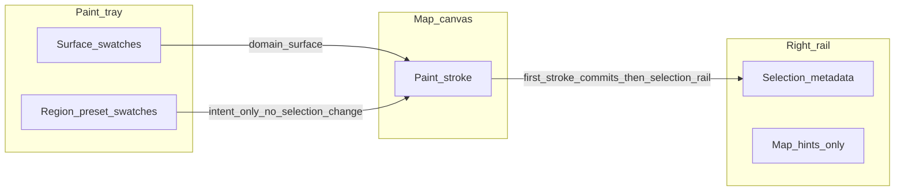

# Region paint tray + Selection-first refactor

## Recommended policy (authoritative)

- **Swatch click** updates paint intent only (`domain`, `pendingRegionColorKey`, and/or `activeRegionId` per rules below). It does **not** change **`mapSelection`** or the right rail — **Selection is unchanged until a paint stroke commits create or extend.**
- **First paint stroke** (pointer down on a cell with a valid create or extend paint state) **commits** the action: **create** (new `regionEntries` row + `activeRegionId`) or **extend** (cells map to existing `activeRegionId`). On **create**, also set **`mapSelection`** to that region and **`setRailSection('selection')`** so metadata appears. Subsequent cells in the same drag use the same region id.
- **Selection** remains the **only** place for region **metadata and color** editing (name, description, color field) — no duplicate metadata UI in Map or tray.
- **Edit region** (in Selection) explicitly **binds paint mode** to the selected region: `paint` tool, `domain: 'region'`, `activeRegionId` = that id, **`setRailSection('selection')`** so the inspector stays home while spatial editing.
- **`activeRegionId` cleanup** (existing `useEffect` that nulls paint `activeRegionId` when the entry disappears from `regionEntries`) **stays as-is** — do not weaken or bypass it.

## 1) Recommendation summary

- **Yes**: Region **paint controls** (preset swatches, “new region” intent, and optional “which region am I extending” if you keep it) belong in the **paint tray**, not behind a Map-rail detour.
- **Yes**: **Selection** should remain the **only** place for region **name / description / color** — it already is via [`LocationMapRegionMetadataForm`](src/features/content/locations/components/workspace/rightRail/selection/LocationMapRegionMetadataForm.tsx); the gap is **Map rail duplication** and **rail switching**, not missing forms.
- **Behavior**: After choosing a region swatch, **nothing** updates until the **first paint stroke**. That stroke **creates** a region with the preset color (if `activeRegionId` was null) or **extends** cells into the bound region; **only then** set **`mapSelection`** and focus the **Selection** rail on create. **Extend** when **`activeRegionId`** already points at a real entry (e.g. after **Edit region** from Selection).
- **Active region model**: Keep **`activeRegionId`** as “the region ID cells receive when painting.” Add **`pendingRegionColorKey`** (name TBD) for “about to create a region on first stroke.” That is the cleanest way to make [`canApplyRegionPaint`](src/features/content/locations/domain/authoring/editor/paint/locationMapPaintSelection.helpers.ts) / stroke logic explicit without overloading `activeRegionId`.
- **Map tab**: After this, the **Map rail is not required** for region authoring. It can stay as **surface** guidance and **generic** paint/erase hints (and any future **map-wide** settings you add later), but **not** as the home for region tools.
- **“Add region” / “New region”**: **Yes — remove** the explicit button **in the same pass** if first-stroke creation is implemented; it becomes redundant.

## 2) Proposed state / model changes

**Extend** [`LocationMapPaintState`](src/features/content/locations/domain/authoring/editor/types/locationMapEditor.types.ts):

- `domain: 'surface' | 'region'` (unchanged).
- `selectedSurfaceFill` (unchanged).
- `activeRegionId: string | null` — region being painted **when it already exists** (extend path).
- **`pendingRegionColorKey: LocationMapRegionColorKey`** — used when `domain === 'region'` and you are in **create** intent (`activeRegionId == null`). First successful stroke **creates** the entry, sets `activeRegionId`, assigns cells, updates `mapSelection`, then clears “pending” semantics (or leaves `pendingRegionColorKey` synced to the created entry’s color — pick one consistent rule in code).

**Helpers** in [`locationMapPaintSelection.helpers.ts`](src/features/content/locations/domain/authoring/editor/paint/locationMapPaintSelection.helpers.ts):

- **`canApplyRegionPaint`** → split or extend into something like:
  - **extend**: `domain === 'region'` and `resolveActiveRegionEntry(...) != null`
  - **create**: `domain === 'region'` and `activeRegionId == null` and `pendingRegionColorKey` set
- **`canApplyAnyPaintStroke`** must treat **create** as valid so [`useLocationGridPaintStroke`](src/features/content/locations/components/workspace/useLocationGridPaintStroke.ts) accepts pointerdown (today it blocks when no `activeRegionId`).
- **`createInitialPaintState()`** — when entering paint mode, keep default `domain: 'surface'`; when user picks **region** in tray, set `domain: 'region'`, `pendingRegionColorKey` default (e.g. first of [`LOCATION_MAP_REGION_COLOR_KEYS`](src/features/content/locations/domain/model/map/locationMapRegionColors.types.ts)), `activeRegionId: null`.

**Workspace handlers** ([`useLocationEditWorkspaceModel.ts`](src/features/content/locations/routes/locationEdit/useLocationEditWorkspaceModel.ts)):

- **`handlePaintChange`**: **Stop** forcing Map rail for region — remove or change [`shouldSwitchRailToMapForPaintDomain`](src/features/content/locations/domain/authoring/editor/rail/locationMapEditorRail.helpers.ts) to **always false** and delete the helper if unused (update its test in [`locationMapEditorRail.helpers.test.ts`](src/features/content/locations/domain/authoring/editor/__tests__/rail/locationMapEditorRail.helpers.test.ts)).
- **Replace `handleCreateRegionPaint`** with logic invoked **only** from the **first cell** of a stroke when creating: `crypto.randomUUID()`, `LOCATION_MAP_DEFAULT_REGION_NAME`, `colorKey: pendingRegionColorKey`, `upsertRegionEntry`, set `activePaint.activeRegionId`, set `mapSelection: { type: 'region', regionId }`, `selectedCellId` via [`selectedCellIdForMapSelection`](src/features/content/locations/components/workspace/rightRail/locationEditorRail.helpers.ts), **`setRailSection('selection')`**. **Do not** call this from swatch click.
- **`handleSelectActiveRegionPaint` / `handleEditRegionInSelection`**: Narrow or remove depending on UI; see §5–6.
- **New**: `handleBeginRegionPaintFromSelection(regionId)` — `setMode('paint')` (or ensure paint), `setActivePaint({ domain: 'region', activeRegionId: regionId, pendingRegionColorKey: <entry.colorKey>, selectedSurfaceFill: null })`, **`setRailSection('selection')`** (do **not** switch to Map). This satisfies “tool = paint, tab = Selection.”
- **Swatch click (new region intent)** in tray handler: `domain: 'region'`, `activeRegionId: null`, update `pendingRegionColorKey` — **does not** mutate `mapSelection` or rail (per **Recommended policy**).

**[`mapPlaceSuppressesCanvasPanOnCells`](src/features/content/locations/routes/locationEdit/useLocationEditWorkspaceModel.ts)** — today it uses `canApplyRegionPaint` only; extend so **pending-create** also suppresses pan (same as extend).

## 3) Proposed tray changes

File: [`LocationMapEditorPaintTray.tsx`](src/features/content/locations/components/workspace/leftTools/paint/LocationMapEditorPaintTray.tsx)

- **Remove** the “Use the Map panel for region tools.” copy.
- **Restructure** to match the target: **Surface** section header + existing surface rows (reuse [`LocationMapEditorTraySectionHeading`](src/features/content/locations/components/workspace/leftTools/tray)); **Region** section header + **preset region swatches** (reuse `getMapRegionColor` + `LOCATION_MAP_REGION_COLOR_KEYS` like the current Map panel).
- **Interaction**:
  - Clicking a **surface** swatch keeps current behavior: `domain: 'surface'`, set `selectedSurfaceFill`.
  - Clicking a **region** swatch: `domain: 'region'`, set `pendingRegionColorKey`, **`activeRegionId: null`** (new region intent), keep `selectedSurfaceFill` null or unchanged (prefer explicit null for region domain). **Does not** change `mapSelection` or rail (commit on first stroke only).
- **Extend mode** (`activeRegionId` set via **Edit region**): tray can **highlight** the bound region’s preset for clarity; choosing a **different** region swatch clears `activeRegionId` and sets `pendingRegionColorKey` (new-region intent) — still **no** Selection change until first stroke.

**Props**: Tray uses **`onPaintChange`** only; **no** draft/`mapSelection` updates from the tray (stroke path owns commit).

## 4) Proposed Selection-tab changes

Files: [`LocationEditorSelectionPanel.tsx`](src/features/content/locations/components/workspace/rightRail/selection/LocationEditorSelectionPanel.tsx), [`LocationMapRegionMetadataForm.tsx`](src/features/content/locations/components/workspace/rightRail/selection/LocationMapRegionMetadataForm.tsx), [`locationEditWorkspaceRailPanels.tsx`](src/features/content/locations/routes/locationEdit/locationEditWorkspaceRailPanels.tsx), [`LocationEditRoute.tsx`](src/features/content/locations/routes/LocationEditRoute.tsx)

- Add **`onEditRegionSpatially?: (regionId: string) => void`** (name to match codebase style) plumbed from the workspace model.
- In **`LocationMapRegionMetadataForm`**, add a primary or secondary **“Edit region”** (or “Paint region”) control that calls this **once** with `region.id`.
- **Remove** the inverted flow where Map rail’s “Edit region” jumps to Selection ([`handleEditRegionInSelection`](src/features/content/locations/routes/locationEdit/useLocationEditWorkspaceModel.ts)) — Selection becomes the **source** of “enter region paint for this id”, not the destination from Map.

## 5) What happens to current Map-tab region controls

File: [`LocationMapEditorPaintMapPanel.tsx`](src/features/content/locations/components/workspace/rightRail/panels/LocationMapEditorPaintMapPanel.tsx)

- **Strip** region-specific UI: [`RegionPaintActiveRegionSelect`](src/features/content/locations/components/workspace/leftTools/paint/RegionPaintActiveRegionSelect.tsx), **New region**, preset grid, **Edit region** button, active region name block.
- **Keep** a short **surface** hint when `paint.domain === 'surface'` (current first branch).
- For **`paint.domain === 'region'`**, use **minimal** copy (one short line) so users who open Map accidentally are not stranded — e.g. point to the **tray** for presets and **Selection** for details. Avoid empty silence if a single line improves discoverability; keep it **brief**.

[`LocationEditWorkspaceMapAuthoringRailPanel`](src/features/content/locations/routes/locationEdit/locationEditWorkspaceRailPanels.tsx): drop props **`onCreateRegion`, `onSelectActiveRegion`, `onActiveRegionColorKeyChange`, `onEditRegionInSelection`** if nothing consumes them after Map panel slimming.

## 6) Paint stroke: create on first cell

File: [`useLocationGridPaintStroke.ts`](src/features/content/locations/components/workspace/useLocationGridPaintStroke.ts)

- Region branch today only runs when [`canApplyRegionPaint`](src/features/content/locations/domain/authoring/editor/paint/locationMapPaintSelection.helpers.ts) is true. Extend to handle **create** path:
  - **Option A (recommended)**: pass **`ensureRegionForPaintStroke: (cellId) => void`** from [`LocationGridAuthoringSection`](src/features/content/locations/components/workspace/LocationGridAuthoringSection.tsx) wired from the route/model — it updates **draft + activePaint + mapSelection + rail** atomically (or in a stable order: draft first, then paint state).
  - **Option B**: pass `setDraft` + `setActivePaint` + `setRailSection` — avoid; too many hooks.

The **first cell** of a stroke should: create region if needed, then apply `regionIdByCellId[cellId]`.

## 7) Implementation sequence

1. **Types + helpers**: add `pendingRegionColorKey`, update `createInitialPaintState`, `canApplyRegionPaint` / `canApplyAnyPaintStroke`, tests in [`locationMapPaintSelection.helpers.test.ts`](src/features/content/locations/domain/authoring/editor/__tests__/paint/locationMapPaintSelection.helpers.test.ts).
2. **Workspace**: implement create-on-stroke + rail selection focus; remove Map-rail auto-switch for region; update pan suppression; add `handleBeginRegionPaintFromSelection`.
3. **Tray UI**: section headers + region swatches; remove detour text.
4. **Stroke hook + grid wiring**: plumb `ensureRegionForPaintStroke` (or equivalent).
5. **Selection**: add **Edit region** → `handleBeginRegionPaintFromSelection`.
6. **Map panel + rail props**: delete duplicated controls and unused props; clean exports/imports.
7. **Docs/comments**: update [`locationEditorRail.helpers.ts`](src/features/content/locations/components/workspace/rightRail/locationEditorRail.helpers.ts) comment that still references region → Map.

## 8) Risks / open decisions

| Topic | Risk / decision |
|--------|-----------------|
| **Swatch click while a region is selected** | **Resolved by policy**: swatch does **not** change Selection. Choosing a **new** region swatch sets `activeRegionId: null` + `pendingRegionColorKey` only; user may still see the old region in Selection until the **first stroke** creates the new region and updates selection. |
| **Hex region boundary overlay** | [`LocationGridAuthoringSection`](src/features/content/locations/components/workspace/LocationGridAuthoringSection.tsx) uses `mapSelection` for `activeRegionId` in hex overlays; during **create** paint, selection updates only after **first stroke** — acceptable; verify **Edit region** still highlights if `mapSelection` + paint stay in sync. |
| **Color changes** | Metadata color stays in Selection only; tray presets are **paint/create** intent, not a second metadata editor. |
| **Stale `activeRegionId`** | Existing `useEffect` that nulls missing `activeRegionId` ([`useLocationEditWorkspaceModel.ts`](src/features/content/locations/routes/locationEdit/useLocationEditWorkspaceModel.ts) ~452–459) **remains intact** — do not remove. |

## 9) “Add region” removal

**Yes** — remove **New region** and **`handleCreateRegionPaint`** from the public Map rail once **first stroke** creates a region. Keep **internal** creation logic shared between stroke and any future entry points if needed.
