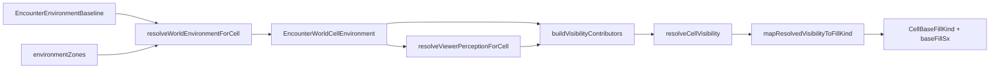

# Environment / perception / visibility (tightened plan)

## Confirmed current flow (code paths)

- **World merge**: `[environment.resolve.ts](src/features/mechanics/domain/environment/environment.resolve.ts)` — scalar fields + magical flags; **no** obscuration cause metadata today.
- **Rules perception**: `[perception.resolve.ts](src/features/mechanics/domain/perception/perception.resolve.ts)` — `maskedByDarkness` when `visibilityObscured === 'heavy' || lightingLevel === 'darkness'` (after MD handling). **Combat blocking for heavy obscurement stays as-is**; only presentation needs source distinction.
- **Presentation**: `[perception.render.projection.ts](src/features/mechanics/domain/perception/perception.render.projection.ts)` — `maskedByDarkness` → old darkness tint; light obscured → dim; **no fog path**.
- **Fog Cloud**: `[level1-a-l.ts](src/features/mechanics/domain/rulesets/system/spells/data/level1-a-l.ts)` — targeting + `heavily-obscured` state only; **no zone** → `[environment-zones-battlefield-sync.ts](src/features/mechanics/domain/environment/environment-zones-battlefield-sync.ts)` never syncs fog.
- **Darkness**: `[level2-a-f.ts](src/features/mechanics/domain/rulesets/system/spells/data/level2-a-f.ts)` — `emanation` + `environmentZoneProfile: 'magical-darkness'`.




---

## Primary goals

1. **Preserve** existing heavy-obscurement combat masking; **no** darkvision / blindsight / capability rewrite in this pass.
2. **Refactor** so **cause/source** survives world merge → contributors → resolved → fill (no half-active `visibility-`*).
3. **Fog Cloud** renders as **fog**, not darkness; **must** use zone/profile path.
4. Keep **lighting** and **obscuration** separate in semantic types (`ResolvedCellVisibility`).
5. **Avoid** redundant parallel baseline structs; **reuse** `EncounterEnvironmentBaseline` / `EncounterWorldCellEnvironment`.

---

## Phase A — Inspect and reuse baseline / world types

**Before** adding structs, confirm in `[environment.types.ts](src/features/mechanics/domain/environment/environment.types.ts)`:

- `EncounterEnvironmentBaseline` — already the authored baseline source of truth (setting, `lightingLevel`, `visibilityObscured`, terrain, atmosphere, etc.).
- `EncounterWorldCellEnvironment` — merged per-cell world; extend **only** with cause metadata.

**Aliases** (export from `environment.types.ts` or a thin barrel), **no** encounter-wide rename:

- `type LightingLevel = EncounterLightingLevel`
- `type ObscuredLevel = EncounterVisibilityObscured`
- `type EnvironmentSetting = EncounterEnvironmentSetting`
- (and similarly for terrain/atmosphere if useful)

Optional: `type EnvironmentBaseline = EncounterEnvironmentBaseline` for documentation.

**Do not** rename `lightingLevel` → `lighting` across the encounter stack.

---

## Phase B — Perception types (`visibility.types.ts`)

**Location**: `src/features/mechanics/domain/perception/visibility.types.ts` (or name aligned with repo conventions).

**Target shape** (adjust names to match style; keep semantics):

- `VisibilityContributor` — lighting | obscuration (with `cause`) | hidden (unrevealed).
- `ResolvedCellVisibility` — `{ lighting, obscured, primaryCause?, hidden }` — **do not** collapse lighting + obscuration into one field.
- `VisibilityFillKind` — `'dim' | 'fog' | 'darkness' | 'magical-darkness' | 'hidden'`.

**Cause unions** should align with merge + presentation precedence (Phase C/E).

Export from `[perception/index.ts](src/features/mechanics/domain/perception/index.ts)` as needed.

---

## Phase C — Extend world merge (cause metadata)

**File**: `[environment.resolve.ts](src/features/mechanics/domain/environment/environment.resolve.ts)`

- **Do not** replace or reorder the existing scalar merge loop.
- **After** the loop, compute **presentation-oriented** obscuration cause metadata from:
  - merged scalars (e.g. `lightingLevel === 'darkness'` without MD → darkness cause),
  - baseline-only heavy obscured → environment,
  - **applicable zones** (see Phase H for fog / MD profiles).

**Prefer** storing enough information for **deterministic precedence** in Phase E — e.g. `ReadonlyArray<ObscurationPresentationCause>` collected from baseline + zones, **or** a minimal structure that the contributor builder can interpret. Single `primaryObscurationCause` is acceptable only if it can be derived with the same precedence rules as the full resolver (document the rule).

**Extend** `EncounterWorldCellEnvironment` (same file as types) with the new field(s). Existing consumers that only read scalars remain valid.

**Atmosphere tags**: remain metadata in `[EncounterEnvironmentBaseline](src/features/mechanics/domain/environment/environment.types.ts)`; **do not** wire into renderer state in this pass.

---

## Phase D — Build contributors (pure helper)

**Location**: perception domain (e.g. `visibility.contributors.ts` or alongside resolver).

**Inputs (conceptual)**:

- merged `EncounterWorldCellEnvironment` (includes cause metadata from Phase C),
- `EncounterViewerPerceptionCell` from existing `[resolveViewerPerceptionForCell](src/features/mechanics/domain/perception/perception.resolve.ts)` — **stable combat semantics**,
- flags needed to express **hidden** / unrevealed-style presentation (today: `!canPerceiveCell` for MD veil cases maps to hidden fill).

**Output**: `VisibilityContributor[]`.

**Rule**: **Do not** re-implement perception rules; **use** `resolveViewerPerceptionForCell` outputs as the seam. Centralize contributor construction so `[perception.render.projection.ts](src/features/mechanics/domain/perception/perception.render.projection.ts)` stops hardcoding fog/darkness collapse.

---

## Phase E — Semantic resolver (precedence)

**Pure function**: contributors (+ minimal extra flags if needed) → `ResolvedCellVisibility`.

**Precedence** (presentation `primaryCause` and fill):

1. Hidden / unrevealed wins over everything.
2. Magical darkness beats darkness.
3. Darkness beats fog.
4. Fog beats generic environment obscurement.
5. Dim / light obscurement → dim-style when no stronger cause.
6. Fully clear → no fill (null from mapper).

**Combat semantics**: Keep the same **outcome** as today for “can’t see occupants” where `maskedByDarkness` / MD already encode it; the resolver **adds** distinct `primaryCause` for presentation without changing combat tests unless a tiny correction is unavoidable.

**Tests**: new focused file (e.g. `visibility.resolve.test.ts`) for precedence cases:

- fog only → heavy + cause fog
- darkness only → darkness wins
- MD + fog → MD wins
- darkness + fog → darkness wins
- hidden + fog → hidden wins

---

## Phase F — Presentation mapping (single place)

**Pure helper**: `mapResolvedVisibilityToFillKind(resolved): VisibilityFillKind | null`

- **Only** this function maps semantic visibility → render fill ids.
- **Do not** scatter decisions across projection and style files.

**Target mapping**:

- hidden → `hidden`
- heavy + magical-darkness → `magical-darkness`
- heavy + darkness → `darkness`
- heavy + fog → `fog`
- dim / light obscurement, no stronger cause → `dim`
- clear → `null`
- (smoke/dust per contributor model if present in merge)

---

## Phase G — Renderer: `VisibilityFillKind` end-to-end

**Replace** all `visibility-`* / `PerceptionPresentationFillKind` usage with `VisibilityFillKind`.

**Files**:

- `[perception.render.projection.ts](src/features/mechanics/domain/perception/perception.render.projection.ts)` — `EncounterGridCellRenderState.perceptionBaseFillKind: VisibilityFillKind | null`; wire through Phase F only.
- `[cellVisualState.ts](src/features/encounter/components/active/grid/cellVisualState.ts)`:

```ts
export type CellBaseFillKind =
  | 'blocked'
  | 'placement-invalid-hover'
  | 'placement-selected'
  | 'placement-cast-range'
  | 'aoe-invalid-origin-hover'
  | 'aoe-origin-locked'
  | 'aoe-template'
  | 'aoe-cast-range'
  | 'persistent-attached-aura'
  | 'paper'
  | VisibilityFillKind;
```

- `[cellVisualStyles.ts](src/features/encounter/components/active/grid/cellVisualStyles.ts)` — exhaustive `switch` for `VisibilityFillKind` + **distinct fog** (smoky gray). Hierarchy:
  - dim = mild veil
  - fog = smoky gray
  - darkness = darker black veil
  - magical darkness = deeper black
  - hidden = near fully hidden

Non-visibility tactical fills unchanged.

**Coherence**: Remove old `visibility-`* strings entirely; no dead branches.

---

## Phase H — Fog Cloud: zone path (required)

1. **Extend** `[AttachedEnvironmentZoneProfile](src/features/mechanics/domain/environment/environment.types.ts)` with `'fog'`.
2. **Update** `[buildZoneForProfile](src/features/mechanics/domain/environment/environment-zones-battlefield-sync.ts)`:
  - `visibilityObscured: 'heavy'`
  - **No** `lightingLevel` override to `darkness`
  - `magical` flags false
  - Enough profile/cause data for Phase C merge (same pattern as MD profile).
3. **Update** Fog Cloud in `[level1-a-l.ts](src/features/mechanics/domain/rulesets/system/spells/data/level1-a-l.ts)`:
  - Add **emanation**: sphere **20**, **place** anchor (same pattern as Darkness: `attachedTo: 'self'`, `anchorMode: 'place'`), `environmentZoneProfile: 'fog'`.
  - Keep **targeting** + `state: heavily-obscured` for gameplay meaning.
  - **Effect order**: follow Darkness — **emanation before targeting/state** if that is local convention.
  - **No** UI-only spell fields.

---

## Phase I — Tests (inspect first, extend; avoid duplication)

**Primary surfaces**:

- `[perception.render.projection.test.ts](src/features/mechanics/domain/perception/__tests__/perception.render.projection.test.ts)` — update expectations to `VisibilityFillKind`; add **fog cell → fog fill, not darkness**; preserve MD regression.
- `[environment-zones-battlefield-sync.test.ts](src/features/mechanics/domain/environment/__tests__/environment-zones-battlefield-sync.test.ts)` — fog profile: heavy obscured, **not** lighting forced to darkness.

Add new focused tests only where **precedence** or **resolver** is not already covered (Phase E/F).

---

## Phase J — Scope control

**Out of scope** for this pass:

- Darkvision, blindsight, Devil’s Sight behavior changes
- Full LOS/pathing rewrite
- Atmosphere-driven visibility
- Weather simulation

**Structure** should leave clear extension points (contributors + capabilities later).

**Optional**: If emanation + profile is trivial for **Stinking Cloud** (heavily obscured cloud), reuse `'fog'` profile — **only if** adapter is already clean and risk is low.

---

## Documentation

- **Create** `[docs/reference/environment.md](docs/reference/environment.md)` — new reference for the environment domain: baseline vs merged world cell, zone layering, attached-aura sync, and **obscuration cause metadata** after this refactor (how it differs from viewer perception). Cross-link to `[perception-and-visibility.md](docs/reference/perception-and-visibility.md)` and existing `[environments.md](docs/reference/environments.md)` where appropriate; avoid duplicating long content that already lives in `environments.md` — prefer a focused index + “see also.”
- Brief update to `[docs/reference/perception-and-visibility.md](docs/reference/perception-and-visibility.md)`: merge → contributors → resolved → fill; fog = obscuration cause, not lighting.
- `[docs/reference/environments.md](docs/reference/environments.md)`: one-line table fix if `visibility-`* is referenced — **only when touching that file**.

---

## Definition of done

- Source-aware visibility flows **merge → contributors → resolved → presentation** with no orphaned `visibility-`* logic.
- Fog renders **distinctly** from darkness.
- **Heavy obscurement** combat behavior **stable** vs existing tests.
- Fog Cloud **participates** in environment zone syncing via profile + emanation.
- **No** unnecessary parallel baseline types or cosmetic rename churn.
- Tests cover **precedence**, **projection** (including fog vs darkness), and **zone** behavior (fog profile).

---

## Implementation note (narrow extension points)

- **World**: extend `EncounterWorldCellEnvironment` + merge tail in `resolveWorldEnvironmentForCell`.
- **Perception**: keep `[perception.resolve.ts](src/features/mechanics/domain/perception/perception.resolve.ts)` as the combat rules engine; add **presentation pipeline** beside it (contributors → resolved → `mapResolvedVisibilityToFillKind`) consumed from `[projectGridCellRenderState](src/features/mechanics/domain/perception/perception.render.projection.ts)` / `resolvePerceptionPresentationFill` replacement.

